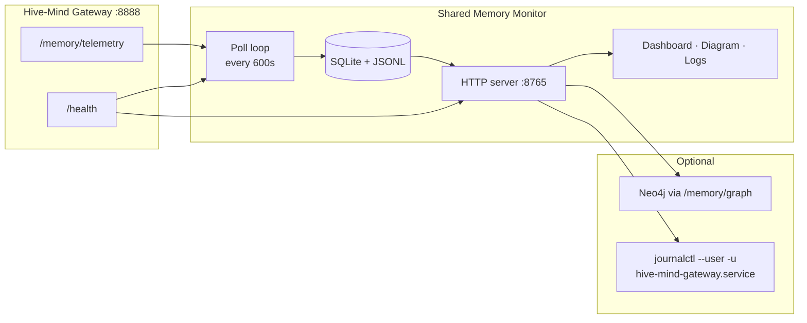

# Shared Memory Monitor

> **Sister project** to the [Shared Memory Framework](https://github.com/KanenasInGreece/Shared_Memory) — an optional, standalone operations dashboard for the REM/NREM dream cycle.

| Framework (memory layer) | Monitor (this repo) |
|------------------------|---------------------|
| Gateway, daemons, Postgres, Neo4j, consolidation | Backlog charts, health grid, logs, local history |
| Agent skill: `memory_bridge.py` | Thin HTTP client — no framework code imported |
| Runs on the gateway host | Runs anywhere with network access to `:8888` |

Live operations UI: REM/NREM backlog, outbox health, gateway infrastructure, schema breakdown, and log tailing. Polls `GET /memory/telemetry` and `GET /health` over HTTP, stores history in SQLite, serves **http://127.0.0.1:8765/**.

**Integration surface:** only public gateway routes (`/health`, `/memory/telemetry`, `/memory/graph`). No Postgres credentials required when the coordinator exposes `telemetry.nrem` and `telemetry.breakdown`.

See [docs/SISTER_PROJECT.md](docs/SISTER_PROJECT.md) for the full relationship model.

## Screenshots

Live views of the gateway and dream-cycle pipeline (captured from a running monitor at `http://127.0.0.1:8765/`).

### Pipeline dashboard

REM/NREM backlog charts, pipeline queues, infrastructure health from `GET /health`, and schema breakdown drill-down.


### Architecture diagram

Live framework topology with gateway-owned I/O: agents connect to the Hive-Mind Gateway (`:8888`); REM and NREM daemons talk to the gateway only; the coordinator mediates all Postgres, Neo4j, and inference hops. Colored flow lines light from poll-interval telemetry and agent/daemon audit — not standing backlog alone. A history scrubber at the bottom replays earlier polls; the caption under it explains live vs replay and the time window.


### Logs

Three tabs: **Gateway daemons** (`journalctl --user`), **REM audit** (outbox review JSONL), and **Agent audit** (per-request agent identity, route, status, latency). Agent audit supports name filter chips, a **File** picker for logrotated `.gz` archives, and optional since/until windowing.


Regenerate after UI changes: `./scripts/capture-screenshots.sh` (uses Playwright via `uv`, full-page capture, waits for live diagram data — monitor must be running).

## Prerequisites

Install and run the monitor only after the items below are in place.

### Required (dashboard + live panels)

| Prerequisite | Why |
|--------------|-----|
| **[Shared Memory Framework](https://github.com/KanenasInGreece/Shared_Memory) gateway running** | The monitor has no data of its own — it reads the gateway APIs. |
| **Gateway reachable at `COORDINATOR_URL`** | Default `http://localhost:8888`. Confirm with `curl -s http://localhost:8888/health`. |
| **User-scoped `hive-mind-gateway.service`** | Gateway runs as a *user* systemd unit. Logs use `journalctl --user -u hive-mind-gateway.service`. |
| **Dedicated read-only monitor token** | Mint a token for the monitor identity (not an agent skill token). On the gateway host, `AGENT_ROLES` must include `monitor:read` so the token can call `/memory/telemetry` and `/memory/graph` but **not** `/memory/save`. |
| **Coordinator with `telemetry.nrem` + `telemetry.breakdown`** | Framework Phase 3 enrichment — schema breakdown and NREM cycle counts come from the telemetry payload. Upgrade/restart the gateway if `check` reports these missing. |
| **Python 3.11+** and **[uv](https://docs.astral.sh/uv/)** | Dependency install and CLI entry point. |

### Not required

| You do **not** need | Because |
|---------------------|---------|
| Postgres (`PG_PASSWORD`, `PG_CONN`) | Breakdown and NREM counts are server-side in `/memory/telemetry`. |
| `memory_bridge.py` or any agent skill install | Monitor uses direct `httpx` to the gateway. |
| Framework repo checkout on the monitor machine | Only `COORDINATOR_URL` + `AGENT_TOKEN` in the monitor `.env`. |
| Neo4j Browser or direct DB access | Graph breakdown goes through `/memory/graph` with the read token. |

### Optional (extra log sources)

| Optional | Enables |
|----------|---------|
| `SHARED_MEMORY_ROOT` or `SM_GATEWAY_ENV` | Audit log paths (`AUDIT_LOG_PATH`, `GATEWAY_AUDIT_LOG_PATH`) when not at the default `~/.shared-memory/logs`. |
| Framework `GATEWAY_AUDIT_LOG_PATH` enabled | **Agent audit** tab — requires coordinator v0.4.11+ on the gateway host. |
| User systemd **linger** (`loginctl enable-linger $USER`) | Gateway (and monitor) user units keep running after logout. |
| `SM_IGNORED_OUTBOX_IDS` | Exclude known stale outbox failure rows from alerts (baseline estimate). |

### Gateway-side token setup (one-time, on the framework host)

If you have not minted a monitor token yet:

```bash
# On the gateway host, in the framework repo:
python shared-memory/scripts/generate_tokens.py   # add monitor:tok_… to gateway .env
# gateway .env must include:
#   AGENT_TOKENS=...,monitor:tok_...
#   AGENT_ROLES=monitor:read
systemctl --user restart hive-mind-gateway.service
```

Copy **only** `tok_…` into the monitor machine's `.env` as `AGENT_TOKEN`. Never reuse a write-capable agent skill token.

---

## Quick start

### 1. Clone and install

```bash
git clone https://github.com/KanenasInGreece/Shared_Memory_Monitor.git
cd Shared_Memory_Monitor
./scripts/install.sh
```

`install.sh` runs `uv sync`, creates `.env` from `.env.example` if missing, and runs `check`.

### 2. Configure the monitor `.env`

Edit `.env` in the monitor repo (this file **wins** over framework or skill copies):

```bash
# Required
AGENT_TOKEN=tok_monitor_...          # dedicated read-only token from gateway host
COORDINATOR_URL=http://localhost:8888

# Optional — REM audit log path discovery only
# SHARED_MEMORY_ROOT=/path/to/shared-memory-GitHub
```

### 3. Confirm the gateway is up

```bash
curl -s http://localhost:8888/health | head -c 200
journalctl --user -u hive-mind-gateway.service -n 3 --no-pager
```

Both should succeed before starting the monitor.

### 4. Verify monitor wiring

```bash
./scripts/check-env.sh
```

Look for:

- `AGENT_TOKEN source: monitor` (not `skill:grok` or similar)
- `telemetry: ok · breakdown ok`
- `read_role: ok` (200 on telemetry, 403 on save probe)
- All core features ✓

The check prints paths and status only — **never** tokens or passwords.

### 5. Start poll loop + dashboard

```bash
./scripts/run-loop.sh --serve --interval 600
```

Open **http://127.0.0.1:8765/**

| URL | Page |
|-----|------|
| `/` | Pipeline dashboard (default) |
| `/diagram` | Live architecture topology |
| `/logs` | Gateway journal, REM audit, agent audit (3s refresh) |

### After moving the repo

Re-run `./scripts/check-env.sh`. Set `SHARED_MEMORY_ROOT` only if the REM audit log tab cannot find `AUDIT_LOG_PATH`.

---

## Features

- **Pipeline dashboard** — dream backlog, REM/NREM split (NREM = pending **consolidation cycles**, not raw fact count), bottleneck detection, ETA projection, outbox queues
- **Architecture diagram** — live topology (agents → gateway ↔ REM/NREM daemons → memory + inference), audit-driven flow highlighting, poll-history replay with interval caption
- **System health** — live gateway, embedder, reranker, LLM, and daemon status (polled every 30s from `/health`)
- **Historical charts** — selectable ranges (`1h` · `6h` · `24h` · `7d` · `all`) with auto-downsampling
- **Schema breakdown** — Neo4j panels via `/memory/graph`; Postgres distributions via `telemetry.breakdown` (no direct DB)
- **Live logs** — gateway journal, REM outbox audit JSONL, **agent audit** JSONL (per-request agent/route/status/latency), agent-name filter chips, logrotated archive picker
- **Stale outbox filtering** — ignore known prerelease failures; alert only on new ones
- **PNG exports** — static chart snapshots written to `graphs/` on each poll

## Architecture



| Process | Command | Responsibility |
|---------|---------|----------------|
| **Poll loop** | `run-loop.sh` | Fetch telemetry, append history, render PNGs |
| **Web server** | `serve.sh` | Serve UI, live `/api/health`, schema breakdown, read stored history |

The web server does not poll telemetry on its own. Use `--serve` to run both in one process.

## Configuration

### Required variables (monitor `.env`)

| Variable | Example | Purpose |
|----------|---------|---------|
| `AGENT_TOKEN` | `tok_monitor_…` | Read-only bearer token (`monitor:read` on gateway) |
| `COORDINATOR_URL` | `http://localhost:8888` | Gateway base URL |

Monitor `.env` **overrides** framework or skill copies for `AGENT_TOKEN` and `COORDINATOR_URL`.

### Optional variables

| Variable | Default | Purpose |
|----------|---------|---------|
| `SHARED_MEMORY_ROOT` | — | Framework repo path — discovers `MEMORY_LOG_PATH`, `AUDIT_LOG_PATH`, `GATEWAY_AUDIT_LOG_PATH` |
| `SM_GATEWAY_ENV` | — | Explicit path to gateway `.env` (log paths) |
| `SM_JOURNAL_UNIT` | `hive-mind-gateway.service` | User unit for gateway log tab |
| `SM_IGNORED_OUTBOX_IDS` | `4` | Stale outbox IDs excluded from failure alerts |
| `NEO4J_BROWSER_URL` | `http://127.0.0.1:7474` | Neo4j Browser link in UI |
| `MEMORY_LOG_PATH` | `~/.shared-memory/logs` | Client log directory (if not using `SHARED_MEMORY_ROOT`) |
| `AUDIT_LOG_PATH` | `<log_dir>/rem-audit.jsonl` | REM audit JSONL for `/logs` tab |
| `GATEWAY_AUDIT_LOG_PATH` | `<log_dir>/agent-audit.jsonl` | Agent audit JSONL (framework env; legacy `gateway-audit.jsonl` supported) |

Copy `.env.example` to `.env`. `sm_telemetry_monitor check` never prints secret values.

**Do not commit secrets.** `.env` and `.grok/` are listed in `.gitignore`. Only `.env.example` (placeholders, no real tokens) belongs in version control.

### Portability — moving the monitor folder

| Works with local `data/` only | Needs gateway + monitor `AGENT_TOKEN` | Optional `SHARED_MEMORY_ROOT` |
|------------------------------|---------------------------------------|-------------------------------|
| Charts & raw samples from past polls | Live hero, health, breakdown, telemetry poll | Framework log file paths |

`data/telemetry.db` travels with the repo; live panels need a reachable coordinator.

### Environment check

```bash
./scripts/check-env.sh          # human-readable report
./scripts/check-env.sh --json   # machine-readable
uv run python -m sm_telemetry_monitor check
```

Reports: gateway client mode, token source, `.env` files loaded (key names only), connectivity probes, and per-feature readiness (✓/✗ with fix hints).

## Installation (manual)

Use this if you prefer not to run `install.sh`:

```bash
uv sync
cp .env.example .env
# Required: AGENT_TOKEN and COORDINATOR_URL (see Prerequisites)
./scripts/check-env.sh
```

## Run modes

```bash
# Recommended — poll + dashboard
./scripts/run-loop.sh --serve --interval 600

# Poll only (data/ + graphs/, no web UI)
./scripts/run-loop.sh --interval 600

# Dashboard only (history on disk; live /health still works)
./scripts/serve.sh

# Single poll
uv run python -m sm_telemetry_monitor --once

# Open browser after start
./scripts/run-loop.sh --serve --open
```

### CLI reference

```
uv run python -m sm_telemetry_monitor <command> [options]

  loop          Poll telemetry on an interval (default)
  serve         HTTP server only
  check         Validate framework wiring (no secrets printed)

  --interval N  Poll interval in seconds (default: 600)
  --serve       Start dashboard server alongside loop
  --once        Single poll, then exit
  --open        Open dashboard in default browser
  --json        JSON output (check command)
```

Equivalent entry point: `sm-telemetry` (after install).

## Dashboard guide

### Top bar

| Element | Meaning |
|---------|---------|
| **Range** | Chart window (`1h` · `6h` · `24h` · `7d` · `all`) |
| **live** | Connection to monitor API |
| **Last updated** | Timestamp of latest telemetry sample in range |
| **samples** | Number of poll snapshots in range |

### Sidebar

| Block | Source | Meaning |
|-------|--------|---------|
| **Status pill** | Live `/health` | Gateway infrastructure |
| **Dream backlog** | Derived | `rem_backlog` + `nrem_backlog` (cycle count) |
| **Bottleneck** | Derived story | REM vs NREM saturation (compares item backlog vs cycle backlog) |
| **REM / NREM split** | Derived | REM = pending enrichments; **NREM = pending consolidation cycles** (see below) |
| **Pipeline queues** | Telemetry + derived | Per-stage counts; **NREM cycles** and **NREM facts (raw)** shown separately |
| **Infrastructure** | Live `/health` | Process + workload per component |
| **Schema breakdown** | On-demand `/api/breakdown` | Neo4j graph + telemetry.breakdown drill-down |

### Pipeline vs system health

- **Pipeline** — dream-cycle metrics from stored telemetry (backlog, outbox failures)
- **System** — live gateway `/health` (embedder, reranker, LLM, daemons)

System health refreshes every 30s even when the poll loop is stopped. Charts need the poll loop (or existing history).

### Diagram view (`/diagram`)

Live rendering of the framework topology — not a static image. Nodes use `/api/health` and the latest telemetry snapshot; flow lines use poll-interval deltas plus agent/daemon audit for the selected time window.

| Layer | Components | Live data |
|-------|------------|-----------|
| **Agent layer** | Claude Code, Grok, Codex, Antigravity, LM Studio, HTTP clients | Agent audit highlights chips with recent read/write; red/green lines for save and retrieve |
| **Gateway cluster** | Coordinator + REM + NREM daemons (bridge gaps, no direct daemon→store lines) | Process state, dream backlog, outbox sync, gateway version |
| **Memory layer** | Postgres + Neo4j with Outbox · REM · NREM lanes | Docs, summaries, outbox queues, graph facts — all I/O via gateway memory buses |
| **Inference backends** | Reasoning LLM, embedder, reranker (proxied) | `/health` process + workload; blue logic lines per backend |

**Node states:** OK · Active · Waiting · Backlog · Down — see the on-page legend.

**Flow lines:** Write (red) · Read (green) · Logic/proxy (blue). Daemon↔gateway read/write light only when the last poll interval or daemon audit shows activity — standing `rem_backlog` / `facts_unconsolidated` alone does not keep them lit. Agent saves light the outbox lane (Postgres → Neo4j), not a direct gateway→Neo4j write.

**Poll history scrubber:** Slider at the bottom steps through stored telemetry samples (~every 10 min). Right end = **live** (flow lines for the last poll interval). Drag left for **replay** (cumulative activity from history start through that snapshot). A two-line caption under the slider states the mode and timeframe.

Refreshes every 30s in live mode; health polling pauses while scrubbing replay.

## HTTP API

| Endpoint | Description |
|----------|-------------|
| `GET /api/meta` | Sample count, poll config, ignored outbox IDs |
| `GET /api/summary` | Latest snapshot + pipeline story (`nrem_backlog`, `nrem_fact_cycles`, `nrem_decision_cycles`, `facts_unconsolidated`) |
| `GET /api/health` | Live gateway infrastructure health |
| `GET /api/diagram` | Bundled `summary` + `health` for diagram view |
| `GET /api/diagram/agent-activity?since=&until=` | Agent read/write counts and daemon `/v1` proxy tallies for a poll window (audit JSONL) |
| `GET /api/history?range=6h` | Time series + stats + pipeline snapshot |
| `GET /api/breakdown` | Neo4j graph + telemetry.breakdown schema panels (60s cache) |
| `GET /api/logs/sources` | Log sources (`gateway` = Gateway daemons journal, `rem_audit`, `agent_audit`) |
| `GET /api/logs/archives?source=agent_audit` | Live file + logrotated `.gz` archives (basename-only) |
| `GET /api/logs/tail?source=agent_audit&lines=200` | Tail live or archived logs (`archive=` basename; `since=` for time window) |

History `range`: `1h` | `6h` | `24h` | `7d` | `all` — `bucket`: `auto` (default) | `raw` | `<minutes>`

## Data storage

| Path | Format | Purpose |
|------|--------|---------|
| `data/telemetry.db` | SQLite | Primary time-series store |
| `data/telemetry.jsonl` | JSONL | Append-only export; synced into SQLite on startup |
| `graphs/*.png` | PNG | Static chart exports (updated each poll) |
| `graphs/dashboard.html` | HTML | Offline copy of dashboard |
| `graphs/diagram.html` | HTML | Offline copy of architecture diagram |

Duplicate polls within 60 seconds with identical metrics are skipped.

## Metrics reference

| Metric | Definition |
|--------|------------|
| `dream_backlog` | `rem_backlog` + `nrem_backlog` |
| `rem_backlog` | `facts_rem_pending` + `decisions_rem_pending` — items awaiting REM enrichment |
| `nrem_backlog` | Pending NREM **consolidation cycles** (see [NREM counting](#nrem-backlog-counting)) |
| `nrem_fact_cycles` | Fact-derived portion of `nrem_backlog` |
| `nrem_decision_cycles` | Decision-derived portion of `nrem_backlog` |
| `facts_unconsolidated` | From `GET /memory/telemetry` — count of `rem_processed` facts not yet `consolidated`. **Diagnostic only; not queue depth** |
| `facts_consolidated` | `facts_total − facts_rem_pending − facts_unconsolidated` |
| `outbox_failed` | Actionable failures (raw count minus ignored IDs) |

### NREM backlog counting

The framework does **not** consolidate one fact per NREM wake. A consolidation **cycle** runs only when a density threshold is met per domain cluster — matching `consolidation_loop.py` in the Shared Memory Framework.

| Trigger | Threshold | Cluster key | Source |
|---------|-----------|-------------|--------|
| Facts | **≥ 5** `rem_processed`, unconsolidated facts | `(entity, domain)` | `telemetry.nrem.fact_cycles` (computed server-side) |
| Decisions | **≥ 2** `rem_processed`, unconsolidated decisions | `domain` | `telemetry.nrem.decision_cycles` |

**Why not use `facts_unconsolidated`?** Telemetry reports every qualifying fact (e.g. 25 facts), but NREM may only owe a handful of cycles (e.g. 2 entity-domain clusters with ≥5 facts each → **2 cycles**, not 25). Raw fact count overstates operator urgency.

**Monitor path:** The coordinator joins Neo4j clusters with Postgres domain metadata and exposes the result as `telemetry.nrem` (`fact_cycles`, `decision_cycles`, `total_cycles`). The monitor reads and persists these fields — it does not recompute them locally.

**Fallback:** If `telemetry.nrem` is missing, the monitor estimates `nrem_backlog ≈ facts_unconsolidated // 5` and sets `nrem_backlog_source: "estimate"`. Live counts use `nrem_backlog_source: "telemetry"`.

**UI mapping:**

| Dashboard label | API field | Meaning |
|-----------------|-----------|---------|
| Sidebar **NREM** | `nrem_backlog` | Pending consolidation cycles |
| Pipeline **NREM cycles** | `nrem_backlog` | Same |
| Pipeline **NREM facts** | `facts_unconsolidated` | Raw telemetry reference |
| Chart **NREM cycles** | `series.nrem_backlog` | Historical cycle backlog |
| Table **NREM** column | `series.nrem_backlog` | Per-sample cycle count |

## Running as a service

A **foreground** start from Grok Build or a terminal stops when that session ends. For persistence across logout, use the **systemd user unit** shipped in the repo.

| Prerequisite | Check |
|--------------|-------|
| User linger | `loginctl show-user $USER -p Linger` → `yes` (else `loginctl enable-linger $USER`) |
| Gateway user unit | `systemctl --user is-active hive-mind-gateway.service` |
| Monitor `.env` | `AGENT_TOKEN` + `COORDINATOR_URL` in project `.env` |

**Install (recommended):**

```bash
./scripts/install-systemd-user.sh
```

Unit template: `deploy/systemd/user/shared-memory-monitor.service` (`@MONITOR_ROOT@` substituted at install). Details: `deploy/README.md`.

**Manual install:**

```bash
mkdir -p ~/.config/systemd/user
cp deploy/systemd/user/shared-memory-monitor.service ~/.config/systemd/user/
# edit paths in the unit if your checkout is elsewhere
systemctl --user daemon-reload
systemctl --user enable --now shared-memory-monitor.service
```

Put `AGENT_TOKEN` and `COORDINATOR_URL` in the monitor `.env` referenced by `EnvironmentFile`. Add `SHARED_MEMORY_ROOT` only if you need REM audit log path discovery.

## Project layout

```
shared-memory-monitor/
├── deploy/
│   ├── README.md        # systemd install notes
│   └── systemd/user/shared-memory-monitor.service
├── docs/
│   ├── images/          # README screenshots (regenerate with capture-screenshots.sh)
│   └── SISTER_PROJECT.md
├── scripts/
│   ├── install.sh       # uv sync + .env scaffold + check
│   ├── install-systemd-user.sh  # user unit → ~/.config/systemd/user/
│   ├── pre-publish-check.sh   # secret audit before git push
│   ├── publish.sh             # audit + push origin/main
│   ├── capture-screenshots.sh # README UI captures (Playwright full-page)
│   ├── capture_screenshots.py # capture helper (invoked by shell script)
│   ├── check-env.sh     # Framework wiring doctor
│   ├── run-loop.sh      # Poll loop (optional --serve)
│   └── serve.sh         # Dashboard only
├── src/sm_telemetry_monitor/
│   ├── doctor.py        # Environment check (no secret output)
│   ├── bridge.py        # Standalone httpx gateway client
│   ├── env_loader.py    # .env discovery (monitor .env wins)
│   ├── collector.py     # Gateway poll + flatten
│   ├── analytics.py     # Derived backlog + pipeline story
│   ├── nrem_backlog.py  # telemetry.nrem parsing
│   ├── store.py         # SQLite + JSONL
│   ├── system_health.py # Live /health rollup
│   ├── breakdown.py     # Neo4j graph + telemetry.breakdown panels
│   ├── logs_reader.py   # journalctl --user + file tailing
│   ├── server.py        # HTTP API + static files
│   └── cli.py           # Entry point
├── static/              # Live UI (dashboard, diagram, logs, theme)
├── data/                # Runtime (gitignored)
└── graphs/              # PNG exports + offline HTML copy
```

## Troubleshooting

| Symptom | Fix |
|---------|-----|
| Unsure what is configured | `./scripts/check-env.sh` |
| Dashboard shows old backlog | Run poll loop (`run-loop.sh` or `--serve`); restart server after code updates |
| NREM looks too high vs gateway `status` | Compare `nrem_backlog` (cycles) to `facts_unconsolidated` (raw facts) — sidebar shows both |
| NREM cycles show `estimate` | Gateway must expose `telemetry.nrem` — upgrade/restart framework coordinator |
| `AGENT_TOKEN source: skill:grok` | Put a dedicated monitor token in monitor `.env` — do not borrow agent tokens |
| Telemetry poll fails / 401 | Check `AGENT_TOKEN` in monitor `.env`; confirm token is in gateway `AGENT_TOKENS` |
| Schema breakdown empty | Gateway must expose `telemetry.breakdown` — upgrade/restart coordinator |
| Gateway log tab empty | Confirm user unit: `journalctl --user -u hive-mind-gateway.service -n 5`; check linger |
| Agent audit tab empty | Enable `GATEWAY_AUDIT_LOG_PATH` on gateway host (framework `.env`); restart `hive-mind-gateway.service`; generate authenticated traffic |
| Agent audit archives missing | Install logrotate for audit jsonl — see `deploy/logrotate/shared-memory-audit.example` |
| After moving monitor folder | Re-run `check-env.sh`; set `SHARED_MEMORY_ROOT` only for audit log paths |
| Port 8765 in use | `fuser -k 8765/tcp` |

## Documentation

| Doc | Contents |
|-----|----------|
| [README.md](README.md) | Prerequisites, quick start, API, troubleshooting |
| [docs/SISTER_PROJECT.md](docs/SISTER_PROJECT.md) | Sister-repo model vs Shared Memory Framework |
| [deploy/README.md](deploy/README.md) | systemd user unit install |
| [SECURITY.md](SECURITY.md) | Secrets policy, pre-push audit |
| [CONTRIBUTING.md](CONTRIBUTING.md) | PR expectations |
| [CHANGELOG.md](CHANGELOG.md) | Release notes |
| [THIRD_PARTY_NOTICES.md](THIRD_PARTY_NOTICES.md) | Dependency licenses |

## Publishing to GitHub

Before the first push:

```bash
./scripts/pre-publish-check.sh   # secret audit
./scripts/publish.sh             # audit + push origin main
```

**Never committed** (see `.gitignore`): `.env`, `.grok/`, `data/*`, `graphs/*` (runtime exports), `.venv/`.

Create a GitHub release tagged `vX.Y.Z` to match [CHANGELOG.md](CHANGELOG.md).

## Related projects

- **[Shared Memory Monitor](https://github.com/KanenasInGreece/Shared_Memory_Monitor)** — this repository
- **[Shared Memory Framework](https://github.com/KanenasInGreece/Shared_Memory)** — gateway, REM/NREM daemons, `GET /memory/telemetry`
- **shared-memory skill** — agent CLI (`memory_bridge.py`); monitor uses the same HTTP routes directly

## License

**MIT License** — see [LICENSE](LICENSE). This repository is independent of the framework's license; runtime integration is HTTP-only. Dependency notices: [THIRD_PARTY_NOTICES.md](THIRD_PARTY_NOTICES.md).