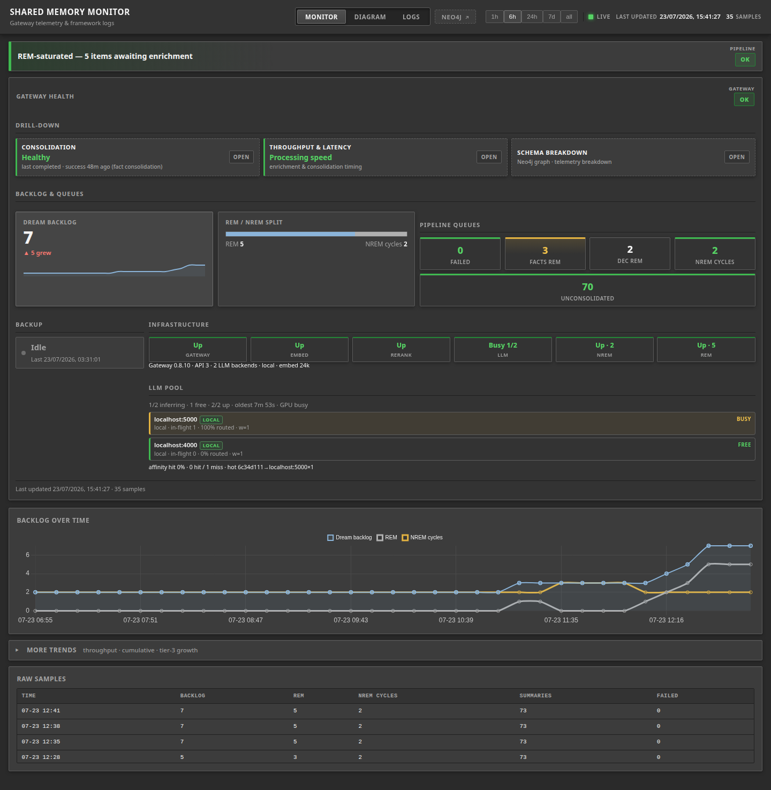
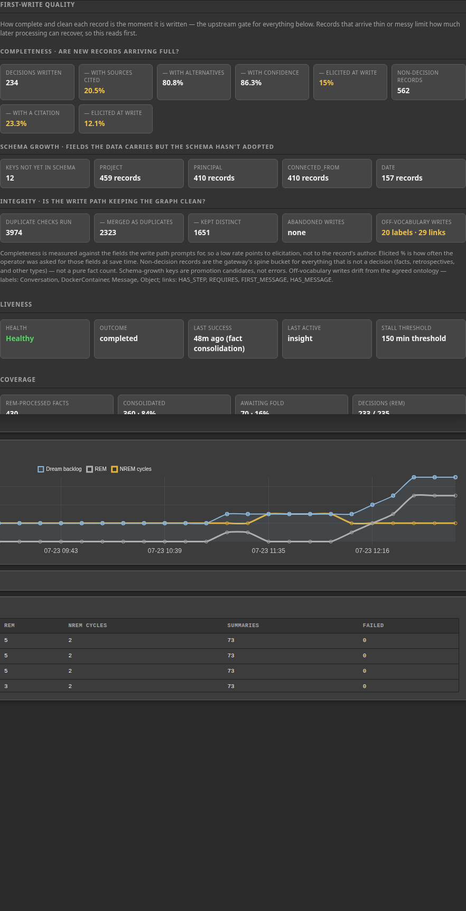
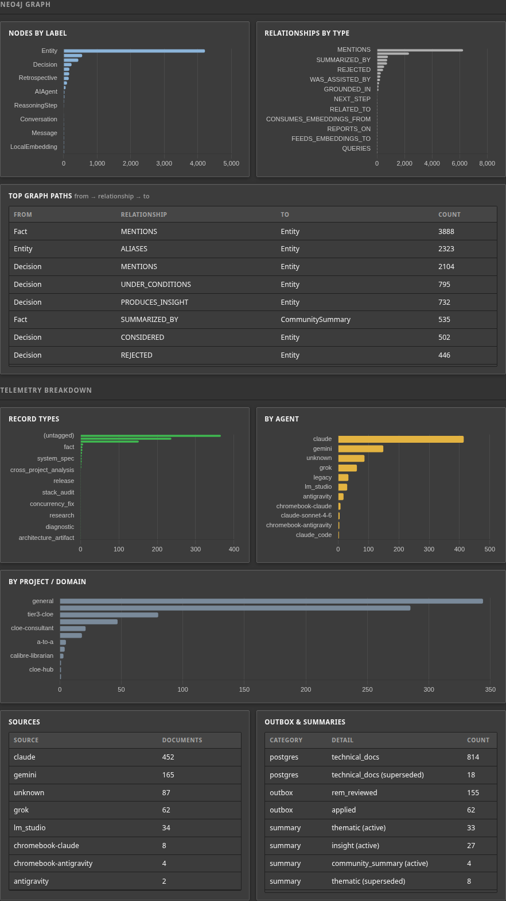
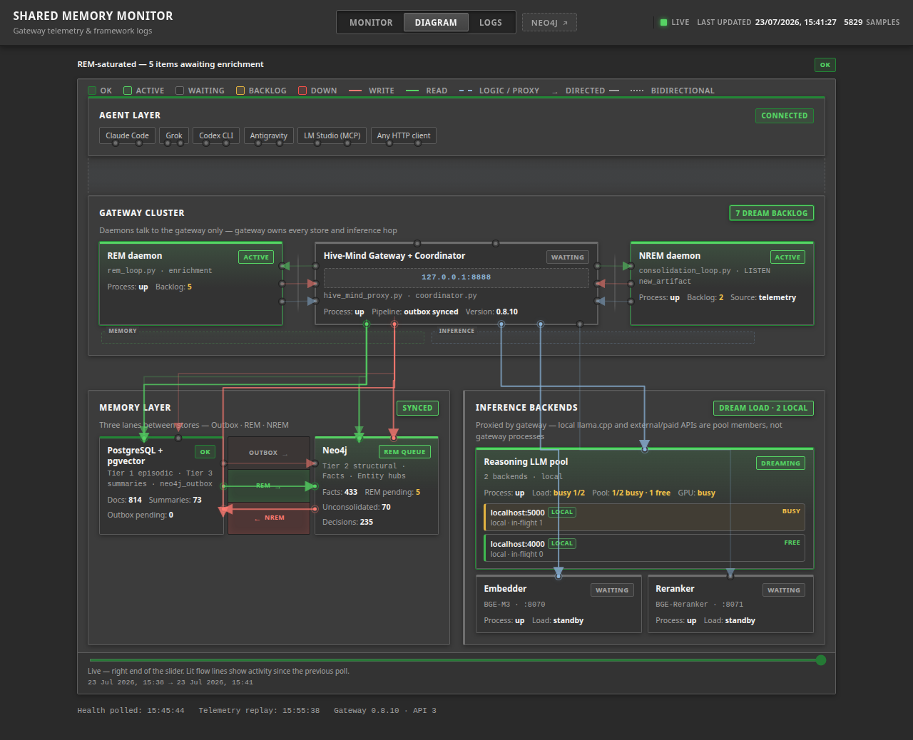
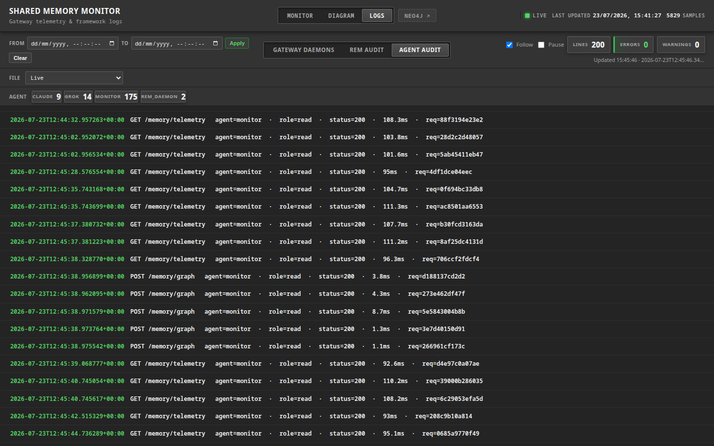
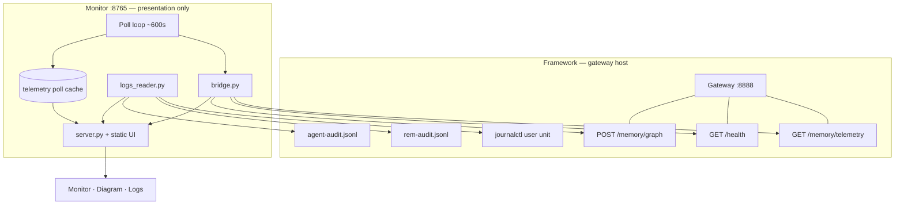

# Shared Memory Monitor



## Visualise what is happening to your shared memory framework

**Shared Memory already provides full telemetry** The gateway publishes that as
`GET /health` and `GET /memory/telemetry` (plus read-only graph and framework
logs). This sister project turns those **existing** signals into a live ops
picture: backlog and REM/NREM pressure, consolidation liveness and coverage,
first-write quality, graph shape, latency, topology, and audit trails — so you
**see** the pipeline instead of grepping JSON and journals.

| | |
|--|--|
| **What you get** | Visual ops aid over **framework-owned** telemetry and logs |
| **What you do not get** | A second metrics store, DB credentials, or write access to memory |
| **Dashboard** | **http://127.0.0.1:8765/** |
| **This release** | **v0.7.8** — **API v3** client · framework **≥ v0.7.0** (wire) · full Status + **diagram** LLM pool on **≥ v0.8.9** (**local/external** placement) |

---

## Quick start

Give your agent (Claude, antigravity, etc) the **[AGENTS.md](AGENTS.md)** and it will do: interview → install →
wire `monitor:read` → verify with `./scripts/agent-status.sh` → start/upgrade.

Prefer complete control? Humans can use the same scripts below.

```bash
git clone https://github.com/KanenasInGreece/Shared_Memory_Monitor.git
cd Shared_Memory_Monitor
./scripts/install.sh
```

### Gateway token (issued by the framework)

You will need to generate an `AGENT_TOKEN`, which the shared memory framework mints — this is not a stand-alone project, but rather an add-on. The [Shared Memory Framework](https://github.com/KanenasInGreece/Shared_Memory) ships a dedicated **`monitor`** identity for this dashboard: register it in gateway `AGENT_TOKENS`, assign **`monitor:read`** in `AGENT_ROLES`, and copy the minted token here. That role is read-only — `GET /health`, `GET /memory/telemetry`, and guarded `POST /memory/graph` only; `POST /memory/save` and search return **403**.

**How to mint it** (on the gateway host): run the framework's [`generate_tokens.py`](https://github.com/KanenasInGreece/Shared_Memory/blob/main/shared-memory/scripts/generate_tokens.py) (or `bootstrap_tokens.sh` on a fresh install). It prints `AGENT_TOKENS=...,monitor:tok_...` and `AGENT_ROLES=monitor:read`. Add those lines to the **gateway** `.env`, restart `hive-mind-gateway.service`, then paste the `monitor` token below.

Details: [Framework SECURITY.md — read-only roles (`AGENT_ROLES`)](https://github.com/KanenasInGreece/Shared_Memory/blob/main/SECURITY.md#agent-authentication--implemented-v035).

Edit **this repo's** `.env` (monitor `.env` wins over framework/skill copies for `AGENT_TOKEN` and `COORDINATOR_URL`):

```bash
AGENT_TOKEN=tok_...                  # monitor token from framework generate_tokens.py
COORDINATOR_URL=http://localhost:8888
# SHARED_MEMORY_ROOT=/path/to/framework   # optional — audit log path discovery
```

```bash
curl -s http://localhost:8888/health | head -c 200
./scripts/agent-status.sh            # gateway, doctor, unit, dashboard + GitHub updates
# or: ./scripts/check-env.sh         # full doctor report
./scripts/run-loop.sh --serve --interval 600
```

Open **http://127.0.0.1:8765/**

| Path | Page |
|------|------|
| `/` | Pipeline dashboard (+ consolidation, latency, schema drawers) |
| `/diagram` | Framework topology |
| `/logs` | Journal + audit tail (3s refresh) |

**Persist as a user service** (optional): `./scripts/install-systemd-user.sh` then  
`systemctl --user restart shared-memory-monitor.service`.

**Check for updates / upgrade:** `./scripts/agent-status.sh` reports whether
`origin/main` or a newer GitHub release tag is ahead; then
`./scripts/agent-upgrade.sh` (pull + `uv sync` + restart unit + status).

---

## Contents

- [See the dream cycle — without new data plumbing](#see-the-dream-cycle--without-new-data-plumbing)
- [Quick start](#quick-start)
- [AGENTS.md](AGENTS.md) — agent-operable install / status / upgrade
- [What this is](#what-this-is)
- [Screenshots](#screenshots)
- [Prerequisites](#prerequisites)
- [Architecture](#architecture)
- [Pages in detail](#pages-in-detail)
- [Configuration](#configuration)
- [Run modes](#run-modes)
- [HTTP API](#http-api)
- [Data on disk](#data-on-disk)
- [Metrics](#metrics)
- [systemd service](#systemd-service)
- [Project layout](#project-layout)
- [Troubleshooting](#troubleshooting)
- [Docs & release](#docs--release)
- [Related](#related)
- [License](#license)

---

## What this is

**Shared Memory Monitor** is a sister project to the framework — a read-only **view** over **gateway telemetry** and **framework logs**. It does not own memory stores, daemons, or a separate metrics API.

**Compatibility (v0.7.8):** wire contract **API v3** (`X-SM-Api-Version: 3`) against **Shared Memory Framework gateway ≥ v0.7.0** — `./scripts/check-env.sh` / `agent-status.sh` should report `compat=ok`. For the full ops picture (Status + **diagram** LLM pool with **local** vs **external** badges, consolidation graph health + REM fairness instruments, latency drawer), run **gateway ≥ v0.8.9**; older gateways stay compatible and simply omit missing fields. Doctor prints which telemetry panels and placement signals are present.

| | Framework | Monitor (this repo) |
|---|-----------|---------------------|
| **Role** | Memory layer — gateway, daemons, Postgres, Neo4j | Presents telemetry + logs |
| **Agent surface** | `memory_bridge.py` skill / MCP | Two clients only: `bridge.py`, `logs_reader.py` |
| **Credentials** | Full gateway + DB secrets on gateway host | `monitor:read` token in monitor `.env` only |
| **Upstream data** | Serves telemetry; writes journal + audit JSONL | Reads those directly — never Postgres/Neo4j |
| **Wire contract** | `api_version` on `GET /health` (0.7.0 → **3**) | `bridge.API_VERSION` must match deployed gateway |

Three browser views (**Monitor**, **Diagram**, **Logs**) over the **same two upstream sources**:

| Upstream | Code | Framework exposes |
|----------|------|-------------------|
| **Gateway telemetry** | `bridge.py` | `GET /memory/telemetry`, `GET /health`, `POST /memory/graph` |
| **Framework logs** | `logs_reader.py` | `journalctl --user` + `rem-audit.jsonl` + `agent-audit.jsonl` |

| On screen | Traces to |
|-----------|-----------|
| Backlog, outbox, NREM, charts, hero | `GET /memory/telemetry` (cached in `data/telemetry.db` between polls) |
| Infrastructure, diagram node health, gateway version / API / config | `GET /health` (+ `config` on framework ≥0.6.1) |
| **LLM pool** chips · **local/external** badges | `/health.llm_pool` + `/health.config.llm_backends` (`has_credential` + optional `model`, ≥0.8.9) |
| Schema Neo4j panels | `POST /memory/graph` |
| Schema Postgres panels | `telemetry.breakdown` in the telemetry payload |
| First-write quality · schema conformance | `telemetry.spine` + `telemetry.compliance` |
| Throughput & latency drawer | `telemetry.latency` |
| Consolidation tile + drawer | `/health.consolidation` + `telemetry.consolidation` (+ `entity_graph` / `neo4j`) |
| Log panes | Journal + audit files the framework writes |
| Diagram agent/daemon flows | Same `agent-audit.jsonl` as the **Agent audit** log tab |

`data/telemetry.db` caches past telemetry responses — not a third source. `:8765` `/api/*` routes are **UI transport** to the browser.

See [docs/SISTER_PROJECT.md](docs/SISTER_PROJECT.md) for the sister-repo contract.

---

## Screenshots

Captured from a running monitor (`./scripts/capture-screenshots.sh`).

### Monitor (`/`)

*(Same frame as the hero image under the title — recaptured with current UI.)*

A full-width **status deck** above the charts, in three labelled rows — **Drill-down** (Consolidation, Throughput & latency, Schema breakdown), **Backlog & queues** (Dream backlog, REM / NREM split, Pipeline queues), and Backup / **Infrastructure** (component grid + **LLM pool** when the gateway has more than one backend) — followed by backlog charts. All from gateway telemetry (cached polls + live `GET /health`). Range selector (`1h`–`all`) filters the local poll cache.

On **gateway ≥0.8.9**, the Infrastructure hint includes the non-secret config summary (e.g. `Gateway 0.8.9 · API 3 · 2 LLM backends · local · embed 24k`), and each pool chip badges **local** or **external** from `has_credential` (optional `model` override appears in the chip meta). No API keys ever appear.


### Consolidation health (side drawer)

Opens from **Drill-down → Consolidation**. The drawer reads the gateway's consolidation telemetry and `GET /health`, and shows the dream cycle's health on two axes — what it has **produced** (coverage) and what it has **to work with** (graph health):

- **First-write quality** (upstream, gateway v0.6.2+) — completeness of high-signal fields, schema-growth candidates, integrity (including off-vocabulary labels/links from `telemetry.compliance`). Non-decision totals include facts **and** retrospectives after framework API v2.
- **Liveness** — health verdict, last outcome, time since the last successful fold **with cycle type**, stalled type list, last active cycle, and the stall threshold. The Status tile names which type(s) are stalled (`Stalled [fact consolidation]`) because the gateway ORs stall across types — one healthy cycle can leave the headline red while a sibling is still folding. A deferred cycle with an **explicit** empty eligible census reads as **idle**; unknown eligibility keeps the deferred reason (e.g. pool busy). The only red state is a genuine stall.
- **Coverage** (output side) — from the `telemetry.neo4j` fact census: REM-processed facts, how many are consolidated (count and %), and how many still await a fold. **Consolidations by type** lists the summaries produced — insights, thematic, community — with any superseded count.
- **Graph health · entity resolution** (input side, gateway v0.6.0+; v0.6.1 semantics) — from `telemetry.entity_graph`: total entities, the **Mentioned** share (entities with live fact/decision mentions — the ones that can seed a fold), the **Structural only** share (entities holding graph edges but no live mention), **Orphans** (truly dangling degree-0 nodes — a hygiene defect, flagged when nonzero), **Singletons**, and the alias layer (**Alias edges** · groups · alias coverage · **largest alias group**) written by the v0.6.1 entity-resolution alias-writer. The counts include entities from records still awaiting REM — REM is the stage that builds an entity's relationships — so an **Awaiting REM** figure is shown and the fragmentation share reads as an upper bound until REM catches up.
- **REM reliability · stranded & fairness** (gateway ≥0.7.x, decision 819; fairness ≥0.8.6 / fact 895 · decision 894) — from `telemetry.neo4j`: **Dead-lettered** (records retired at the retry cap) and **Failing** (still accumulating chargeable failures but not yet retired — the "stranded record" case: picked up repeatedly, never succeeded, never blamed, previously invisible), plus the **Retry cap** (warn styling when nonzero). Gateway ≥0.8.6 also surfaces **Passed over (yield)** and **Starved pending** as **instrument** counters (dashed/slate, not fault-warn): zeros under a thin backlog are honest dormancy; nonzero means the fairness path is live for before/after measurement.
- **By cycle** — insight and fact-consolidation rows with outcome, last success, eligible clusters, oldest wait, last error, **24h activity** (runs, average cycle seconds, folds succeeded/attempted), and **Deferred/Idle (24h)** (decision 842, **provisional**: the per-consumer idle-clock split's timer values are reasoned defaults, not measured optima — a retrospective is owed once a full load cycle of this data accumulates). Insight empty runs and fact-consolidation folds differ by orders of magnitude in cost — read the per-type row, not only the headline.



### Schema breakdown (side drawer)

Opens from **Drill-down → Schema breakdown** — a slide-over panel on the right, not a separate page. Neo4j graph from `POST /memory/graph`; Postgres inventory from `telemetry.breakdown` (plus `technical_docs` / superseded counts).



### Diagram (`/diagram`)

Live framework topology: agents → gateway; REM/NREM ↔ gateway; memory and inference via gateway buses. Node counts from telemetry; health from `GET /health`; flow lines from telemetry deltas + agent-audit JSONL.



### Logs (`/logs?source=agent_audit`)

**Agent audit** tab: per-request `agent`, route, `status`, latency from `agent-audit.jsonl`. Also **Gateway daemons** (journal) and **REM audit** (outbox JSONL).



---

## Prerequisites

### Gateway HTTP (required)

| Item | Notes |
|------|-------|
| Framework gateway running | `hive-mind-gateway.service` (user unit) |
| `COORDINATOR_URL` reachable | Default `http://localhost:8888` |
| **`monitor:read` token** | Framework-issued read-only identity — see [Quick start](#gateway-token-issued-by-the-framework) |
| `telemetry.nrem` + `telemetry.breakdown` | Phase 3 coordinator fields — upgrade gateway if `check` reports missing |
| `telemetry.consolidation` + `/health.consolidation` | ADR-018 consolidation signal (v0.4.7+) — upgrade gateway if `check` reports `has_consolidation: false` |
| `telemetry.entity_graph` | **Requires framework gateway v0.6.0+** (v0.6.1 for the corrected orphan count, `unmentioned_entities`, and the alias-layer KPIs). Feeds the consolidation drawer's **Graph health** (input-side entity-resolution axis: mention coverage, singletons, alias edges/groups, node-degree hubs). On older gateways absent fields degrade to omitted KPIs (no error). |
| `/health.llm_pool` + `/health.llm_backends` | Emitted by v0.6.1+ gateways with more than one `LLM_BACKENDS` entry — per-backend busy on the LLM tile, **LLM pool panel** (in-flight / routed % / weight / fails / cooldown chips), and pool-slot REM gating. Single-backend gateways omit them; the tiles keep the nvtop semantics. |
| `/health.llm_oldest_inflight_age_s` (+ optional `llm_suspect_wedged`) | Oldest open LLM call age (wedge visibility) on the pool summary / LLM caption; wedge list warns when the gateway flags hung generation. |
| `/health.llm_affinity` (live) | Multi-backend runtime affinity hit/miss/hot-prefix counters under the pool panel (distinct from static knobs in `config`). |
| `/health.config` | **Framework gateway v0.6.1+** — always-on non-secret echo of resolved LLM backends + weights, pool tuning, affinity knobs, and `embed_max_chars`. Shown under Infrastructure (and hover detail) even on single-backend installs. **≥0.8.9:** each backend may include `has_credential` (bool) and optional `model` — monitor badges **local** vs **external** on the LLM pool panel and in the config summary (no secrets). |
| `telemetry.spine` | **Framework gateway v0.6.2+** — feeds the consolidation drawer's **First-write quality** band (record completeness, schema-growth candidates, duplicate-resolution). After **API v2 / retro-as-record (gateway ≥0.6.5)**, spine “facts” is the **non-decision** bucket (facts + retrospectives + other types) — the UI labels it accordingly. Older gateways omit the block (band hidden, no error). |
| `telemetry.compliance` | **Framework gateway v0.6.3+** — feeds **Schema conformance** (graph writes inside the agreed ontology). Older gateways omit it. |
| `telemetry.latency` | **Framework gateway v0.6.3+** — feeds the **Throughput & latency** drawer (per-model enrichment model-floor vs queue-wait split; consolidation-cycle p50/p95). Older gateways omit it (drawer shows an unsupported note). |
| `postgres.technical_docs_superseded` | Soft-superseded row count on Schema drawer meta (and poll cache). |
| Client `X-SM-Api-Version` | Monitor **v0.7.8** advertises **api_version 3** — compatible with **framework ≥ v0.7.0**; full panel set + LLM placement on **≥ v0.8.9**. `./scripts/check-env.sh` reports `server=N client=N compat=ok` and which telemetry panels / placement signals are present. |
| Python 3.11+ and [uv](https://docs.astral.sh/uv/) | `uv sync` / CLI |

### Local logs (required for `/logs` and diagram flows; same host as gateway in practice)

| Item | Default path / command |
|------|----------------------|
| Gateway journal | `journalctl --user -u hive-mind-gateway.service` |
| REM audit | `~/.shared-memory/logs/rem-audit.jsonl` (`AUDIT_LOG_PATH`) |
| Agent audit | `~/.shared-memory/logs/agent-audit.jsonl` (`GATEWAY_AUDIT_LOG_PATH` on framework) |

### Local backups (optional — Status sidebar “Last” date)

| Item | Default / notes |
|------|-----------------|
| Backup manifests | `~/.shared-memory/backups/sm-backup-*.manifest.json` (`BACKUP_DIR` on framework host) |
| Monitor override | Set `BACKUP_DIR` in monitor `.env` when manifests live outside the default path |

The **Backup** card lights when `backup_in_progress` is true on `GET /health`. The **Last** line is the `created` timestamp from the newest manifest — not yet on `/health`. If the directory is missing or empty, the UI shows **Last never**.

### Not required

Postgres/Neo4j credentials, `memory_bridge.py`, or a framework checkout on the monitor machine (only URL + token required for HTTP plane).

### Optional

`SHARED_MEMORY_ROOT` / `SM_GATEWAY_ENV` (non-default log paths), `BACKUP_DIR` (non-default backup manifest path), `loginctl enable-linger`, `SM_IGNORED_OUTBOX_IDS`, remote monitor (HTTP works over network; logs and backup manifests need local paths).

---

## Architecture

Two read clients, one web server, one poll cache. **No other I/O paths.**



| Module | Upstream | Role |
|--------|----------|------|
| `bridge.py` | Gateway `:8888` | Sole telemetry client — `get_telemetry()`, `get_health()`, `query_graph()` |
| `logs_reader.py` | Journal + JSONL | Sole log client — `tail_source()`, `agent_activity()` |
| `collector.py` + `store.py` | Via `bridge.py` | Append telemetry JSON to poll cache |
| `server.py` + `static/` | Via bridge + logs_reader | Serve cached/live telemetry and log bytes to the browser |
| `analytics.py`, `system_health.py` | Telemetry JSON only | Display formatting — no extra fetches |

Charts read the **poll cache** (past `GET /memory/telemetry` responses). Live panels call `bridge.py` or `logs_reader.py` directly.

| Page | Gateway telemetry | Framework logs |
|------|-------------------|----------------|
| **Monitor** charts, hero, backlog | ✓ cached `GET /memory/telemetry` | — |
| **Monitor** infrastructure | ✓ `GET /health` | — |
| **Monitor** schema drawer | ✓ telemetry + `POST /memory/graph` | — |
| **Diagram** node metrics | ✓ telemetry + `GET /health` | — |
| **Diagram** flow lines | ✓ telemetry interval deltas | ✓ agent-audit JSONL |
| **Logs** | — | ✓ journal + REM + agent JSONL |

---

## Pages in detail

### Monitor dashboard (`/`)

| Control / block | Upstream |
|-----------------|----------|
| **Range** (`1h`–`all`) | Filters cached telemetry polls |
| **Hero** headline | Derived labels from cached telemetry JSON |
| **Gateway health** pill | Deck-level status from `/api/health` (gateway-class: processes, backends, consolidation stall). Hover shows summary; per-component color is in the **Infrastructure** grid only. |
| **Drill-down → Consolidation** | `GET /health` → `consolidation` (cached liveness); opens drawer from `telemetry.consolidation` + `telemetry.neo4j` + `telemetry.entity_graph` |
| **Drill-down → Schema breakdown** | `telemetry.breakdown` + `POST /memory/graph` |
| **Dream backlog** | `rem_backlog + nrem_backlog` telemetry fields |
| **REM / NREM split** | `rem_backlog` vs `nrem_backlog` + ETA (the saturation verdict lives in the hero, not here) |
| **Pipeline queues** | Telemetry postgres/neo4j/outbox fields |
| **Backup** card | `GET /health` (`backup_in_progress`) + latest `sm-backup-*.manifest.json` in `BACKUP_DIR` |
| **Infrastructure** grid | `GET /health` component blocks (gateway · embed · rerank · LLM · NREM · REM) |
| **Infrastructure** config hint | `/health.version` · `api_version` · `/health.config` summary (backend count, **local/external** mix when `has_credential` present, embed cap) |
| **LLM pool** panel | Multi-backend only: `/health.llm_pool` + reachability; chips join `config.llm_backends` for **placement** (`local`/`external`) + `model` (≥0.8.9). Single-backend installs keep nvtop/`inference_busy` on the LLM tile. |

Consolidation drawer fields:

| Field | Source / meaning |
|-------|------------------|
| **Liveness** (health · outcome · last success · stall threshold) | `GET /health.consolidation` (cached) + `telemetry.consolidation` |
| **Coverage** — REM-processed facts | `facts_total − facts_rem_pending` (`telemetry.neo4j`) |
| **Coverage** — consolidated (N · %) | `rem_processed − facts_unconsolidated`, over REM-processed |
| **Coverage** — awaiting fold (N · %) | `facts_unconsolidated`, over REM-processed |
| **Graph health** — entities · mentioned · structural only · orphans · singletons | `telemetry.entity_graph` (gateway v0.6.0+; v0.6.1 semantics) — mention coverage and fragmentation before a fold; orphans = degree-0 dangling, flagged when nonzero |
| **Graph health** — alias edges · groups · coverage · largest group | `alias_edges` · `alias_components` · `alias_covered_entities` · `largest_alias_component` — the v0.6.1 entity-resolution alias layer |
| **Graph health** — top hub degree | Highest entity degree in `entity_graph.top_hubs` |
| **Graph health** — awaiting REM | `facts_rem_pending + decisions_rem_pending` — pre-REM entities inflate the fragmentation share; shown as a caveat, not a verdict |
| **REM reliability** — dead-lettered · failing · retry cap · passed-over · starved | `telemetry.neo4j.rem_dead_lettered` / `rem_failing` / `rem_max_attempts` (gateway ≥0.7.x, decision 819); `rem_passed_over_total` / `rem_starved_pending` (gateway ≥0.8.6, fact 895 · decision 894) |
| **By cycle → Eligible** | `eligible_clusters` — clusters awaiting a fold (a count, not a ratio) |
| **By cycle → Oldest wait** | `eligible_oldest_age_seconds` — age of the oldest cluster still waiting |
| **By cycle → Deferred/Idle (24h)** | `deferred_24h` / `idle_24h` (gateway ≥0.7.x, decision 842, **provisional** — see note in drawer) |

Main charts: backlog over time, throughput, cumulative cleared, tier-3 growth & errors, raw samples table.

### Framework topology (`/diagram`)

```
  Agent layer          Claude · Grok · Codex · Antigravity · LM Studio · HTTP
         │  bottom read/write ports
         ▼
  Gateway cluster      REM daemon ═══ Hive-Mind Gateway + Coordinator ═══ NREM daemon
         ├─ Memory bus ──┬─ PostgreSQL + pgvector ═ Outbox·REM·NREM ═ Neo4j
         └─ Inference bus ─ Reasoning LLM · Embedder · Reranker (proxied)
```

| Layer | Shown from |
|-------|------------|
| **Agents** | `agent-audit.jsonl` |
| **Gateway** | `GET /health` + telemetry backlog fields |
| **Memory** | Telemetry postgres/neo4j counts |
| **Inference** | Embedder / reranker from `GET /health`; **Reasoning LLM pool** card lists backends from `llm_pool` + `config.llm_backends` with **local/external** placement badges (≥0.8.9) |

**Legend:** OK · Active · Waiting · Backlog · Down — flows Write (red) · Read (green) · Logic (blue).

**Replay:** Slider steps stored polls (~10 min). Caption under slider shows live vs replay window. Health polling pauses while scrubbing.

### Logs (`/logs`)

| Tab | Source | Format |
|-----|--------|--------|
| **Gateway daemons** | `journalctl --user -u hive-mind-gateway.service` | Plaintext journal |
| **REM audit** | `AUDIT_LOG_PATH` | JSONL outbox reviews |
| **Agent audit** | `GATEWAY_AUDIT_LOG_PATH` | JSONL per-request audit |

Controls: **Follow** / **Pause**, since/until filters, **File** picker (live + `.gz` archives), agent filter chips (agent audit), **Consolidation** filter chip (gateway journal). Deep links: `/logs?source=agent_audit`, `/logs?source=gateway&consolidation=1`.

Gateway journal lines for consolidation observability are severity-colored: `Consolidation run […] CRASHED` (error), `deferring` / `health refresh failed` (warn), completed runs (info).

---

## Configuration

| Variable | Required | Purpose |
|----------|----------|---------|
| `AGENT_TOKEN` | ✓ | `monitor:read` bearer token |
| `COORDINATOR_URL` | ✓ | Gateway base URL (default `:8888`) |
| `SHARED_MEMORY_ROOT` | | Discover audit paths from framework `.env` |
| `SM_GATEWAY_ENV` | | Explicit gateway `.env` for log paths |
| `SM_JOURNAL_UNIT` | | Journal unit (default `hive-mind-gateway.service`) |
| `AUDIT_LOG_PATH` | | REM audit JSONL |
| `GATEWAY_AUDIT_LOG_PATH` | | Agent audit JSONL |
| `BACKUP_DIR` | | Directory of `sm-backup-*.manifest.json` for sidebar **Last** backup date (default `~/.shared-memory/backups`; auto-discovered from framework `.env` via `SHARED_MEMORY_ROOT`) |
| `NEO4J_BROWSER_URL` | | Neo4j Browser tab link |
| `SM_IGNORED_OUTBOX_IDS` | | Stale outbox IDs excluded from alerts (default `4`) |

```bash
./scripts/check-env.sh          # human report
./scripts/check-env.sh --json   # machine-readable
uv run python -m sm_telemetry_monitor check
```

Copy `.env.example` → `.env`. Never commit `.env` or tokens.

---

## Run modes

```bash
./scripts/run-loop.sh --serve --interval 600   # recommended
./scripts/run-loop.sh --interval 600           # poll only → data/ + graphs/
./scripts/serve.sh                             # UI only (uses existing data/)
uv run python -m sm_telemetry_monitor --once   # single poll
```

```
uv run python -m sm_telemetry_monitor [loop|serve|check] [--interval N] [--serve] [--once] [--open] [--json]
```

Entry point alias: `sm-telemetry`

---

## HTTP API

**UI transport only** — every data endpoint proxies `bridge.py` or `logs_reader.py`.

| Endpoint | Upstream |
|----------|----------|
| `GET /api/meta` | Poll config (not framework data) |
| `GET /api/summary` | Latest cached telemetry poll + display story |
| `GET /api/history?range=&bucket=` | Cached telemetry polls |
| `GET /api/health` | `bridge.get_health()` + `telemetry.consolidation` → enriched infrastructure + consolidation tile |
| `GET /api/consolidation` | Live consolidation drill-down (`consolidation.py`) |
| `GET /api/breakdown` | `bridge.get_telemetry()` + `bridge.query_graph()` |
| `GET /api/diagram` | Cached telemetry + `bridge.get_health()` |
| `GET /api/diagram/agent-activity?since=&until=` | `logs_reader.agent_activity()` → `agent-audit.jsonl` |
| `GET /api/logs/tail` etc. | `logs_reader.tail_source()` → journal or JSONL |

---

## Data on disk

| Path | What it is |
|------|------------|
| `data/telemetry.db` | **Poll cache** — copies of `GET /memory/telemetry` (+ health per poll) |
| `data/telemetry.jsonl` | Same cache, JSONL export |
| `graphs/*.png` | Renders from cached telemetry |

Duplicate polls within 60s with identical telemetry are skipped.

---

## Metrics

All fields are **telemetry JSON keys** from `GET /memory/telemetry` (display-derived where noted).

| Field | Meaning |
|-------|---------|
| `rem_backlog` | `facts_rem_pending + decisions_rem_pending` |
| `nrem_backlog` | Pending NREM **consolidation cycles** (not raw fact count) |
| `dream_backlog` | `rem_backlog + nrem_backlog` |
| `facts_unconsolidated` | Diagnostic raw count — **not** queue depth |
| `outbox_failed` | Failures minus `SM_IGNORED_OUTBOX_IDS` |

NREM counts come from `telemetry.nrem` on the gateway — the monitor only displays and caches them. Fallback estimate (`facts_unconsolidated // 5`) when `telemetry.nrem` is absent.

| UI label | Field |
|----------|-------|
| Sidebar / chart **NREM** | `nrem_backlog` (cycles) |
| **NREM facts** | `facts_unconsolidated` (raw) |

### Consolidation signal (ADR-018)

Requires a framework gateway that exposes `telemetry.consolidation` and a cached `/health.consolidation`.

| Source | Field | Meaning |
|--------|-------|---------|
| `/health` (cached ~60s) | `consolidation.stalled` | **Red alert** — eligible backlog, no fold within stall threshold, nothing in-flight (OR across cycle types) |
| `/health` | `consolidation.stalled_types` | Which cycle type(s) are stalled — prefer this over the OR'd flag alone |
| `/health` | `consolidation.fresh` | `false` → show **signal stale**; do not trust `stalled` |
| `/health` | `consolidation.last_outcome` | `completed` \| `crashed` \| `deferred` \| null |
| `/health` | `consolidation.last_success_cycle_type` | Which cycle produced the last success age |
| `telemetry.consolidation` | `insight` / `fact_consolidation` | Per-cycle outcome, in-flight, failures, `last_error`, coverage, **24h** `runs_24h` / `cycle_seconds_avg` / folds / `deferred_24h` / `idle_24h` |
| `telemetry.consolidation` | `last_active_cycle_type` | Most recently started cycle type |
| `telemetry.consolidation.*.backlog` | `eligible_clusters` | Clusters awaiting a fold — **not** the same as `telemetry.nrem` density cycles |
| `telemetry.consolidation.*.deferred_24h` / `idle_24h` (gateway ≥0.7.x, decision 842) | per-cycle 24h counts | **Provisional** — the per-consumer idle-clock split's timer values are reasoned defaults; judge only after a full load cycle accumulates |
| `telemetry.entity_graph` (gateway v0.6.0+) | `entities_total` · `orphan_entities` · `unmentioned_entities` · `singleton_entities` · `alias_edges` · `alias_components` · `alias_covered_entities` · `largest_alias_component` · `top_hubs` · **`genuinely_referenced_entities` (v0.8.6+)** | **Graph health** — input-side fragmentation and the alias layer; v0.6.1 corrected orphans; v0.8.6 genuine-MENTIONS census is the correct alias-coverage denominator |
| `telemetry.neo4j` (gateway ≥0.7.x, decision 819; ≥0.8.6 fact 895 · decision 894) | `rem_dead_lettered` · `rem_failing` · `rem_max_attempts` · `rem_passed_over_total` · `rem_starved_pending` | **REM reliability** — stranded-record signal + batch-vs-solo fairness / starved sub-queue |

`decision_cycles > 0` with `eligible_clusters = 0` is normal (the cluster fails the strict insight gate) — not a stall.

The unmentioned and singleton counts include entities from records still awaiting REM, which build their relationships during REM. The drawer shows an **Awaiting REM** figure so the fragmentation share reads as an upper bound, not a settled verdict.

Correlate stalls in the **Gateway daemons** log tab (Consolidation filter): `CRASHED` (code bug), repeated `deferring` (LLM pool/GPU busy, backup), or `health refresh failed` (stale signal).

---

## systemd service

```bash
./scripts/install-systemd-user.sh    # template: deploy/systemd/user/shared-memory-monitor.service
```

Requires user linger for persistence after logout. Put `AGENT_TOKEN` + `COORDINATOR_URL` in monitor `.env`. See [deploy/README.md](deploy/README.md).

---

## Project layout

```
shared-memory-monitor/
├── static/                 # browser UI (fetches :8765 /api/* only)
├── src/sm_telemetry_monitor/
│   ├── bridge.py           # gateway client → telemetry / health / graph
│   ├── logs_reader.py      # log client → journal + audit JSONL
│   ├── collector.py        # poll loop: bridge → cache
│   ├── store.py            # telemetry poll cache (SQLite/JSONL)
│   ├── analytics.py        # display formatting of telemetry fields
│   ├── system_health.py    # display formatting of GET /health
│   ├── consolidation.py    # ADR-018 liveness + coverage formatting
│   ├── breakdown.py        # bridge telemetry + graph for schema drawer
│   ├── server.py           # UI transport (:8765)
│   ├── doctor.py           # wiring check
│   └── cli.py
├── scripts/                # install, run-loop, capture-screenshots, publish
├── docs/images/            # README screenshots
└── data/                   # runtime (gitignored)
```

Regenerate screenshots: `./scripts/capture-screenshots.sh` (Playwright; monitor must be running).

---

## Troubleshooting

| Symptom | Fix |
|---------|-----|
| Wiring unclear | `./scripts/check-env.sh` |
| Empty charts | Start poll loop or copy `data/` with history |
| `skill:*` token source | Use dedicated monitor token in monitor `.env` |
| NREM `estimate` source | Upgrade gateway for `telemetry.nrem` |
| Consolidation card shows `—` | Upgrade gateway for ADR-018 `telemetry.consolidation`; run `./scripts/check-env.sh` |
| `fresh=false` on consolidation | Coordinator cache refresh failing — check journal for `consolidation health refresh failed` |
| No **LLM pool** / no local·external badges | Need multi-backend pool (v0.6.1+) and **gateway ≥0.8.9** for `has_credential`; doctor says `placement n/a` on older config |
| Doctor missing `entity_graph` / `latency` / `spine` | Optional panels — upgrade framework; UI hides empty bands |
| Empty agent audit | Enable `GATEWAY_AUDIT_LOG_PATH` on gateway; restart gateway |
| Empty gateway log tab | `journalctl --user -u hive-mind-gateway.service -n 5` |
| Port 8765 busy | `fuser -k 8765/tcp` |

---

## Docs & release

| Doc | Topic |
|-----|-------|
| [SISTER_PROJECT.md](docs/SISTER_PROJECT.md) | Framework boundary |
| [CHANGELOG.md](CHANGELOG.md) | Releases (current: **v0.7.8** · API **3** · framework **≥0.7.0** wire · **≥0.8.9** full panels) |
| [SECURITY.md](SECURITY.md) | Secrets policy |

```bash
./scripts/pre-publish-check.sh && ./scripts/publish.sh
# release: tag must match pyproject / __init__ / CHANGELOG
# gh release create v0.7.8 --title "v0.7.8" --notes-file …
```

---

## Related

- [Shared Memory Framework](https://github.com/KanenasInGreece/Shared_Memory) — gateway, daemons, telemetry API (wire **≥0.7.0** / API 3; full monitor UI on **≥0.8.9**)
- **shared-memory skill** — agent CLI; monitor uses the same read routes via `httpx` plus local logs

---

## License

MIT — see [LICENSE](LICENSE). All framework data is read via gateway telemetry (`bridge.py`) or logs (`logs_reader.py`) — no separate monitor interfaces.
