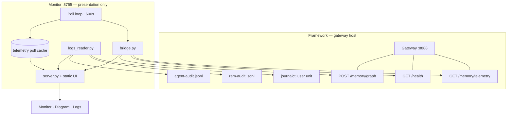

# Shared Memory Monitor

> **Sister project** to the [Shared Memory Framework](https://github.com/KanenasInGreece/Shared_Memory) — a read-only **view** over gateway telemetry and framework logs. **No separate data interfaces in this code.**

| | Framework | Monitor (this repo) |
|---|-----------|---------------------|
| **Role** | Memory layer — gateway, daemons, Postgres, Neo4j | Presents telemetry + logs — no own metrics API |
| **Agent surface** | `memory_bridge.py` skill / MCP | Two clients only: `bridge.py`, `logs_reader.py` |
| **Credentials** | Full gateway + DB secrets on gateway host | `monitor:read` token in monitor `.env` only |
| **Upstream data** | Serves telemetry; writes journal + audit JSONL | Reads those directly — never Postgres/Neo4j |

Serves **http://127.0.0.1:8765/** — three views (**Monitor**, **Diagram**, **Logs**) over the **same two upstream sources**.

### Only two upstream sources

Everything on screen comes from **gateway telemetry** or **framework logs**. This repo does not define parallel data APIs, shadow stores, or framework imports.

| Upstream | Code | Framework already exposes |
|----------|------|---------------------------|
| **Gateway telemetry** | `bridge.py` | `GET /memory/telemetry`, `GET /health`, `POST /memory/graph` |
| **Framework logs** | `logs_reader.py` | `journalctl --user` + `rem-audit.jsonl` + `agent-audit.jsonl` |

| On screen | Traces to |
|-----------|-----------|
| Backlog, outbox, NREM, charts, hero | `GET /memory/telemetry` fields (cached in `data/telemetry.db` between polls) |
| Infrastructure, diagram node health | `GET /health` |
| Schema Neo4j panels | `POST /memory/graph` |
| Schema Postgres panels | `telemetry.breakdown` in the telemetry payload |
| Log panes | Journal + audit files the framework writes |
| Diagram agent/daemon flows | Same `agent-audit.jsonl` as the **Agent audit** log tab |

`data/telemetry.db` is **not** a third source — it caches past telemetry responses. `:8765` `/api/*` routes are **UI transport** to the browser, not alternate backends. `analytics.py` / `system_health.py` only format telemetry or health JSON for display.

See [docs/SISTER_PROJECT.md](docs/SISTER_PROJECT.md) for the sister-repo contract.

---

## Screenshots

Captured from a running monitor (`./scripts/capture-screenshots.sh`).

### Monitor (`/`)

All metrics are gateway telemetry fields (cached polls + live `GET /health` for infrastructure). Range selector (`1h`–`all`) filters the local telemetry cache — not a separate dataset.


### Schema breakdown (drawer on `/`)

Neo4j graph panels from `POST /memory/graph`; Postgres inventory from `telemetry.breakdown` on `GET /memory/telemetry`. Open via **Schema breakdown** in the sidebar — no separate schema API.


### Diagram (`/diagram`)

Live **framework** layout (not the monitor process diagram below). Gateway-owned I/O: agents → coordinator; REM/NREM daemons ↔ gateway only; memory and inference hops via gateway buses. Node counts from telemetry; health badges from `GET /health`; flow lines from telemetry interval deltas + the same agent-audit JSONL as `/logs`. No diagram-specific data API.


### Logs (`/logs?source=agent_audit`)

**Agent audit** tab: per-request `agent`, route, `status`, latency from `agent-audit.jsonl`. Also **Gateway daemons** (journal) and **REM audit** (outbox JSONL). Agent filter chips, **File** archive picker, optional time window.


---

## Quick start

```bash
git clone https://github.com/KanenasInGreece/Shared_Memory_Monitor.git
cd Shared_Memory_Monitor
./scripts/install.sh
```

Edit `.env` (wins over framework/skill copies for `AGENT_TOKEN` and `COORDINATOR_URL`):

```bash
AGENT_TOKEN=tok_monitor_...          # dedicated monitor:read token
COORDINATOR_URL=http://localhost:8888
# SHARED_MEMORY_ROOT=/path/to/framework   # optional — audit log path discovery
```

```bash
curl -s http://localhost:8888/health | head -c 200
./scripts/check-env.sh               # expect: monitor token, telemetry ok, read_role ok
./scripts/run-loop.sh --serve --interval 600
```

Open **http://127.0.0.1:8765/**

| Path | Page |
|------|------|
| `/` | Pipeline dashboard |
| `/diagram` | Framework topology |
| `/logs` | Journal + audit tail (3s refresh) |

---

## Prerequisites

### Gateway HTTP (required)

| Item | Notes |
|------|-------|
| Framework gateway running | `hive-mind-gateway.service` (user unit) |
| `COORDINATOR_URL` reachable | Default `http://localhost:8888` |
| **`monitor:read` token** | In gateway `AGENT_TOKENS` + `AGENT_ROLES=monitor:read`; copy token to monitor `.env` |
| `telemetry.nrem` + `telemetry.breakdown` | Phase 3 coordinator fields — upgrade gateway if `check` reports missing |
| Python 3.11+ and [uv](https://docs.astral.sh/uv/) | `uv sync` / CLI |

Mint token on gateway host:

```bash
python shared-memory/scripts/generate_tokens.py
# gateway .env: AGENT_TOKENS=...,monitor:tok_...  and  AGENT_ROLES=monitor:read
systemctl --user restart hive-mind-gateway.service
```

### Local logs (required for `/logs` and diagram flows; same host as gateway in practice)

| Item | Default path / command |
|------|----------------------|
| Gateway journal | `journalctl --user -u hive-mind-gateway.service` |
| REM audit | `~/.shared-memory/logs/rem-audit.jsonl` (`AUDIT_LOG_PATH`) |
| Agent audit | `~/.shared-memory/logs/agent-audit.jsonl` (`GATEWAY_AUDIT_LOG_PATH` on framework) |

### Not required

Postgres/Neo4j credentials, `memory_bridge.py`, or a framework checkout on the monitor machine (only URL + token required for HTTP plane).

### Optional

`SHARED_MEMORY_ROOT` / `SM_GATEWAY_ENV` (non-default log paths), `loginctl enable-linger`, `SM_IGNORED_OUTBOX_IDS`, remote monitor (HTTP works over network; logs need local journal/files).

---

## Code architecture

Two read clients, one web server, one poll cache. **No other I/O paths.**



| Module | Upstream | Role |
|--------|----------|------|
| `bridge.py` | Gateway `:8888` | Sole telemetry client — `get_telemetry()`, `get_health()`, `query_graph()` |
| `logs_reader.py` | Journal + JSONL | Sole log client — `tail_source()`, `agent_activity()` |
| `collector.py` + `store.py` | Via `bridge.py` | Append telemetry JSON to poll cache |
| `server.py` + `static/` | Via bridge + logs_reader | Serve cached/live telemetry and log bytes to the browser |
| `analytics.py`, `system_health.py` | Telemetry JSON only | Display formatting — no extra fetches |

Charts read the **poll cache** (past `GET /memory/telemetry` responses). Live panels call `bridge.py` or `logs_reader.py` directly — never a monitor-owned metrics service.

### What each page shows (upstream only)

| Page | Gateway telemetry | Framework logs |
|------|-------------------|----------------|
| **Monitor** charts, hero, backlog | ✓ `GET /memory/telemetry` (cached polls) | — |
| **Monitor** infrastructure | ✓ `GET /health` | — |
| **Monitor** schema drawer | ✓ telemetry + `POST /memory/graph` | — |
| **Diagram** node metrics | ✓ telemetry + `GET /health` | — |
| **Diagram** flow lines | ✓ telemetry interval deltas | ✓ agent-audit JSONL |
| **Logs** | — | ✓ journal + REM + agent JSONL |

---

## Framework topology (`/diagram`)

Visual map of the **Shared Memory framework** — live SVG, not a static README image.

```
  Agent layer          Claude · Grok · Codex · Antigravity · LM Studio · HTTP
         │  bottom read/write ports
         ▼
  Gateway cluster      REM daemon ═══ Hive-Mind Gateway + Coordinator ═══ NREM daemon
         │               (daemons ↔ gateway only; gateway owns store + inference I/O)
         ├─ Memory bus ──┬─ PostgreSQL + pgvector ═ Outbox·REM·NREM ═ Neo4j
         └─ Inference bus ─ Reasoning LLM · Embedder · Reranker (proxied, not gateway processes)
         │
  Poll-history scrubber + caption (live vs replay time window)
```

| Layer | Contents | Shown from |
|-------|----------|------------|
| **Agents** | Six client chips | `agent-audit.jsonl` (same file as Logs tab) |
| **Gateway** | REM · coordinator · NREM; `127.0.0.1:8888` inset | `GET /health` + telemetry backlog fields |
| **Memory** | Postgres ↔ lanes (Outbox, REM, NREM) ↔ Neo4j | Telemetry postgres/neo4j counts |
| **Inference** | LLM, BGE-M3 embedder, BGE-Reranker | `GET /health` embedder/reranker/llm blocks |

**Legend:** node states OK · Active · Waiting · Backlog · Down — flows Write (red) · Read (green) · Logic (blue).

**Flow rules:** Daemon↔gateway read/write need interval telemetry or daemon audit — standing backlog alone does not keep lines lit. Agent saves use the **outbox lane** (Postgres → Neo4j), not a direct gateway→Neo4j write.

**Replay:** Slider steps stored polls (~10 min). Right = live (last interval). Left = cumulative replay from history start. Caption under slider shows mode and timestamps. Health polling pauses while scrubbing.

---

## Logs (`/logs`)

| Tab | Source | Format |
|-----|--------|--------|
| **Gateway daemons** | `journalctl --user -u hive-mind-gateway.service` | Plaintext journal |
| **REM audit** | `AUDIT_LOG_PATH` | JSONL outbox reviews |
| **Agent audit** | `GATEWAY_AUDIT_LOG_PATH` | JSONL per-request audit |

Controls: **Follow** / **Pause**, since/until filters, **File** picker (live + `.gz` archives), agent filter chips (agent audit). Deep link: `/logs?source=agent_audit`.

`/api/diagram/agent-activity` is UI transport only — it runs `logs_reader.agent_activity()` on `agent-audit.jsonl`, the same bytes the Logs tab displays.

---

## Monitor dashboard (`/`)

### Top bar

| Control | Meaning |
|---------|---------|
| **Range** | Chart window: `1h` · `6h` · `24h` · `7d` · `all` |
| **live** | Monitor API reachable |
| **Last updated / samples** | Latest telemetry timestamp and count in range |

### Main + sidebar

| Block | Upstream |
|-------|----------|
| **Hero** headline | Derived labels from cached telemetry JSON |
| **Sidebar Status** pill | `GET /health` |
| **Dream backlog** | `rem_backlog + nrem_backlog` telemetry fields |
| **Bottleneck** | Telemetry backlog fields (display math only) |
| **Pipeline queues** | Telemetry postgres/neo4j/outbox fields |
| **Infrastructure** | `GET /health` component blocks |
| **Schema breakdown** drawer | `telemetry.breakdown` + `POST /memory/graph` — see screenshot above |

Main charts: backlog over time, throughput, cumulative cleared, tier-3 growth & errors, raw samples table.

---

## Configuration

| Variable | Required | Purpose |
|----------|----------|---------|
| `AGENT_TOKEN` | ✓ | `monitor:read` bearer token |
| `COORDINATOR_URL` | ✓ | Gateway base URL (default `:8888`) |
| `SHARED_MEMORY_ROOT` | | Discover audit paths from framework `.env` |
| `SM_GATEWAY_ENV` | | Explicit gateway `.env` for log paths |
| `SM_JOURNAL_UNIT` | | Journal unit (default `hive-mind-gateway.service`) |
| `AUDIT_LOG_PATH` | | REM audit JSONL |
| `GATEWAY_AUDIT_LOG_PATH` | | Agent audit JSONL |
| `NEO4J_BROWSER_URL` | | Neo4j Browser tab link |
| `SM_IGNORED_OUTBOX_IDS` | | Stale outbox IDs excluded from alerts (default `4`) |

```bash
./scripts/check-env.sh          # human report
./scripts/check-env.sh --json   # machine-readable
uv run python -m sm_telemetry_monitor check
```

Copy `.env.example` → `.env`. Never commit `.env` or tokens.

---

## Run modes

```bash
./scripts/run-loop.sh --serve --interval 600   # recommended
./scripts/run-loop.sh --interval 600           # poll only → data/ + graphs/
./scripts/serve.sh                             # UI only (uses existing data/)
uv run python -m sm_telemetry_monitor --once   # single poll
```

```
uv run python -m sm_telemetry_monitor [loop|serve|check] [--interval N] [--serve] [--once] [--open] [--json]
```

Entry point alias: `sm-telemetry`

---

## HTTP API (`:8765`)

**UI transport only** — every data endpoint proxies `bridge.py` or `logs_reader.py`. There is no monitor metrics backend.

| Endpoint | Upstream |
|----------|----------|
| `GET /api/meta` | Poll config (not framework data) |
| `GET /api/summary` | Latest cached telemetry poll + display story |
| `GET /api/history?range=&bucket=` | Cached telemetry polls |
| `GET /api/health` | `bridge.get_health()` → gateway `GET /health` |
| `GET /api/breakdown` | `bridge.get_telemetry()` + `bridge.query_graph()` |
| `GET /api/diagram` | Cached telemetry + `bridge.get_health()` |
| `GET /api/diagram/agent-activity?since=&until=` | `logs_reader.agent_activity()` → `agent-audit.jsonl` |
| `GET /api/logs/tail` etc. | `logs_reader.tail_source()` → journal or JSONL |

---

## Data on disk

| Path | What it is |
|------|------------|
| `data/telemetry.db` | **Poll cache** — copies of `GET /memory/telemetry` (+ health per poll) |
| `data/telemetry.jsonl` | Same cache, JSONL export |
| `graphs/*.png` | Renders from cached telemetry |

Not a separate metrics store. Duplicate polls within 60s with identical telemetry are skipped.

---

## Metrics

All fields below are **telemetry JSON keys** from `GET /memory/telemetry` (display-derived where noted).

| Field | Meaning |
|-------|---------|
| `rem_backlog` | `facts_rem_pending + decisions_rem_pending` (derived from telemetry) |
| `nrem_backlog` | Pending NREM **consolidation cycles** (not raw fact count) |
| `dream_backlog` | `rem_backlog + nrem_backlog` |
| `facts_unconsolidated` | Diagnostic raw count — **not** queue depth |
| `outbox_failed` | Failures minus `SM_IGNORED_OUTBOX_IDS` |

### NREM cycle counting

NREM runs consolidation **cycles** when density thresholds are met (facts ≥5 per `(entity, domain)`; decisions ≥2 per `domain`). Counts come from `telemetry.nrem` on the gateway — the monitor only displays and caches them. Fallback estimate (`facts_unconsolidated // 5`) uses other telemetry fields when `telemetry.nrem` is absent; still no local recomputation of framework state.

| UI label | Field |
|----------|-------|
| Sidebar / chart **NREM** | `nrem_backlog` (cycles) |
| **NREM facts** | `facts_unconsolidated` (raw) |

---

## systemd service

```bash
./scripts/install-systemd-user.sh    # template: deploy/systemd/user/shared-memory-monitor.service
```

Requires user linger for persistence after logout. Put `AGENT_TOKEN` + `COORDINATOR_URL` in monitor `.env`. See [deploy/README.md](deploy/README.md).

---

## Project layout

```
shared-memory-monitor/
├── static/                 # browser UI (no data fetching except :8765 /api/*)
├── src/sm_telemetry_monitor/
│   ├── bridge.py           # ONLY gateway client → telemetry / health / graph
│   ├── logs_reader.py      # ONLY log client → journal + audit JSONL
│   ├── collector.py        # poll loop: bridge → cache
│   ├── store.py            # telemetry poll cache (SQLite/JSONL)
│   ├── analytics.py        # display formatting of telemetry fields
│   ├── system_health.py    # display formatting of GET /health
│   ├── breakdown.py        # bridge telemetry + graph for schema drawer
│   ├── server.py           # UI transport (:8765)
│   ├── doctor.py           # wiring check
│   └── cli.py
├── scripts/                # install, run-loop, capture-screenshots, publish
├── docs/images/            # README screenshots
└── data/                   # runtime (gitignored)
```

Regenerate screenshots: `./scripts/capture-screenshots.sh` (Playwright; monitor must be running).

---

## Troubleshooting

| Symptom | Fix |
|---------|-----|
| Wiring unclear | `./scripts/check-env.sh` |
| Empty charts | Start poll loop or copy `data/` with history |
| `skill:*` token source | Use dedicated monitor token in monitor `.env` |
| NREM `estimate` source | Upgrade gateway for `telemetry.nrem` |
| Empty agent audit | Enable `GATEWAY_AUDIT_LOG_PATH` on gateway; restart gateway |
| Empty gateway log tab | `journalctl --user -u hive-mind-gateway.service -n 5` |
| Port 8765 busy | `fuser -k 8765/tcp` |

---

## Docs & release

| Doc | Topic |
|-----|-------|
| [SISTER_PROJECT.md](docs/SISTER_PROJECT.md) | Framework boundary |
| [CHANGELOG.md](CHANGELOG.md) | Releases |
| [SECURITY.md](SECURITY.md) | Secrets policy |

```bash
./scripts/pre-publish-check.sh && ./scripts/publish.sh
```

## Related

- [Shared Memory Framework](https://github.com/KanenasInGreece/Shared_Memory) — gateway, daemons, telemetry API
- **shared-memory skill** — agent CLI; monitor uses the same read routes via `httpx` plus local logs

## License

MIT — see [LICENSE](LICENSE). All framework data is read via gateway telemetry (`bridge.py`) or logs (`logs_reader.py`) — no separate monitor interfaces.