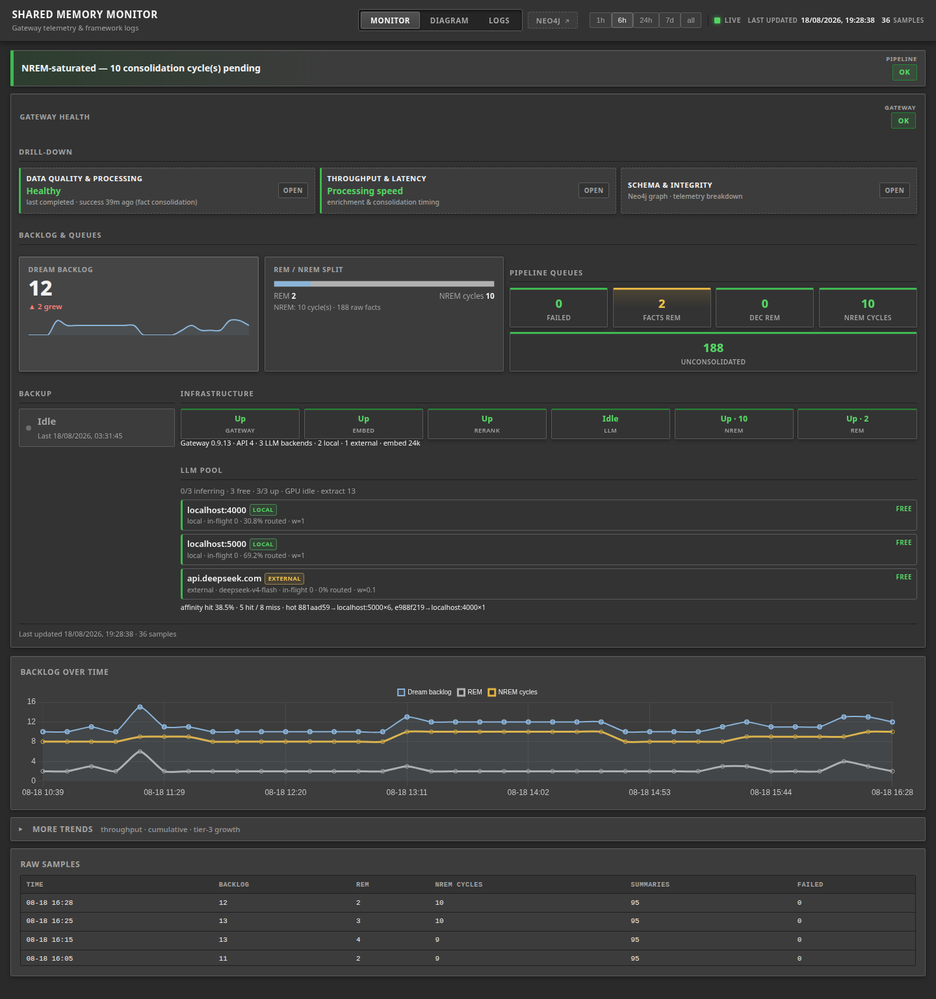
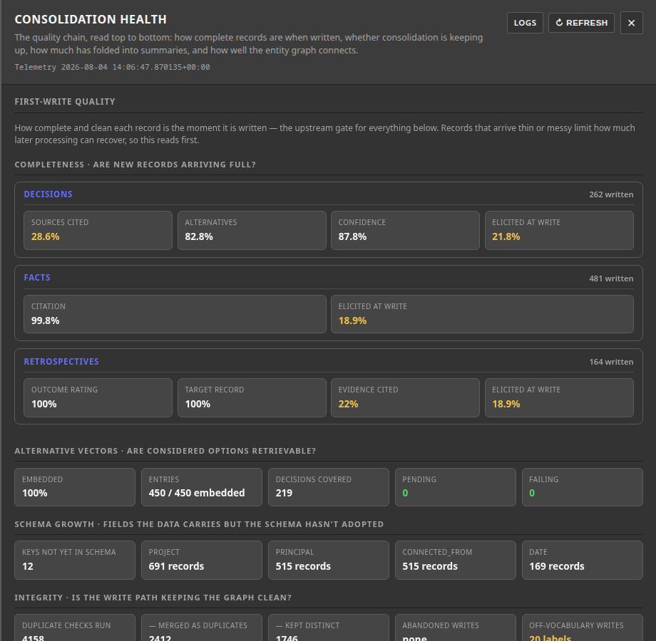
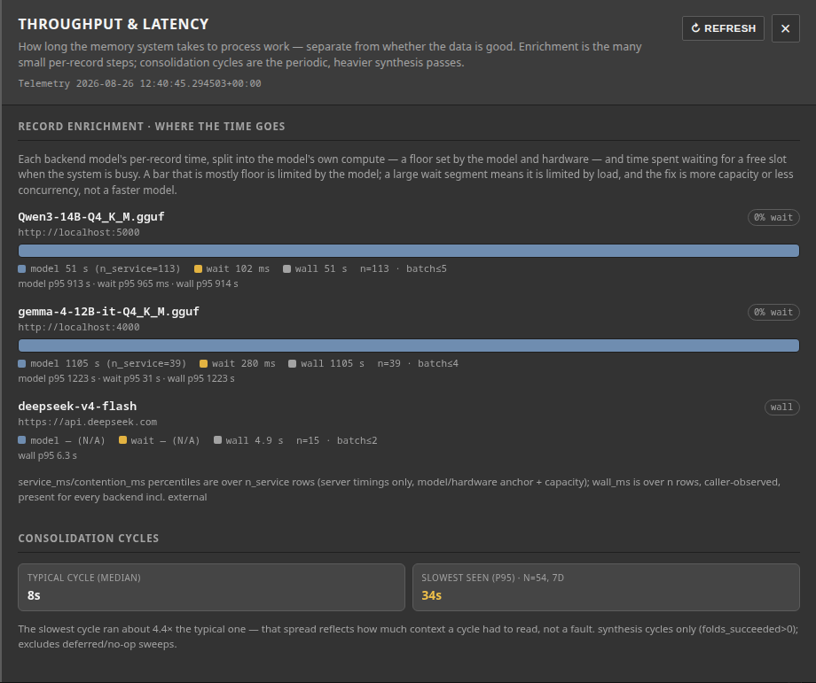
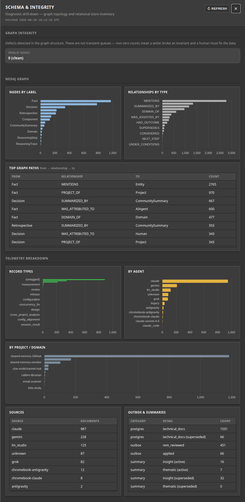
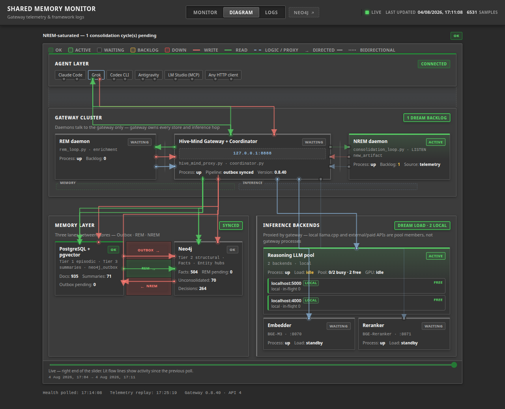
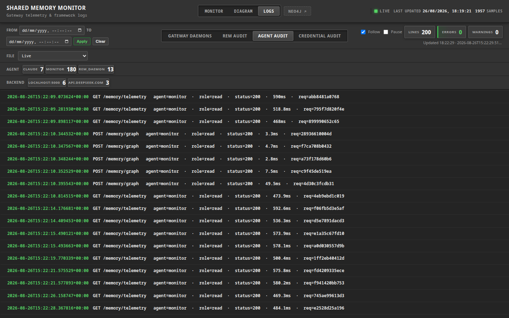
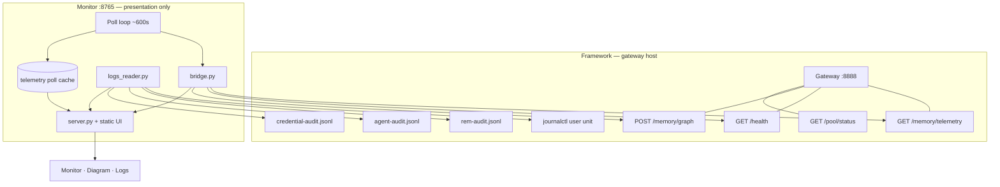

# Shared Memory Monitor



## Why this exists

You already run the **[Shared Memory Framework](https://github.com/KanenasInGreece/Shared_Memory)** — gateway, REM/NREM daemons, LLM pool, Postgres, Neo4j, backups. The framework **owns** its telemetry (`GET /health`, `GET /memory/telemetry`) and the log files it writes. What you usually lack is a single picture of that machinery: not another metrics product, not a field dump of every JSON key, but a **read-only visualisation** so an operator can glance, notice trouble, and open the right log.

This sister repository is that picture. It does not install databases or daemons, does not invent metrics, and does not keep a second truth. It presents what the gateway already exposes and what the framework already writes to disk.

| | |
|--|--|
| **What you get** | Live ops view over framework telemetry and logs |
| **What you do not get** | A second metrics store, DB credentials, or write access to memory |
| **Dashboard** | **http://127.0.0.1:8765/** |
| **This release** | **v0.9.28** — API **v4** client · wire-compatible with framework **≥ 0.8.33** · full panels on **≥ 0.8.9** · alternative vectors on **≥ 0.8.40** · credential-audit / `llm_faults` on **≥ 0.9.4** · credential last-event age on **≥ 0.9.8** · `credentialed_route_denied` on **≥ 0.9.9** · LLM routing / token usage / backend descriptors / `GET /pool/status` dream-ready slots on **≥ 0.9.13** · wall/mixed `by_model` latency on **≥ 0.9.60** |

---

## The operator path: see → attend → log

Three browser pages, one job each:

1. **See** — **Monitor** (`/`) and **Diagram** (`/diagram`). Pipeline pressure, infrastructure health, LLM pool, topology. Telemetry is the signal.
2. **Attend** — warnings, stalled consolidation, a warning on an LLM pool chip, a last-event fault on a backend, or a **gateway door** hint (`token verify failed` / audit log dropped — those are skill→gateway auth, not LLM faults). Something asks for a closer look; open a drawer or click a chip.
3. **Find the detail** — **Logs** (`/logs`). Journal, REM audit, agent audit, credential audit. Filters and a File picker for live and rotated files. Logs are the detail; the dashboard never replaces them.

Telemetry = signal. Logs = detail. The monitor never blurs that line.

---

## Contents

- [Why this exists](#why-this-exists)
- [The operator path: see → attend → log](#the-operator-path-see--attend--log)
- [Quick start](#quick-start)
- [What this is](#what-this-is)
- [Screenshots](#screenshots)
- [Prerequisites](#prerequisites)
- [Architecture](#architecture)
- [Walking the three pages](#walking-the-three-pages)
- [Configuration](#configuration)
- [Run modes](#run-modes)
- [HTTP API and data on disk](#http-api-and-data-on-disk)
- [systemd service](#systemd-service)
- [Troubleshooting](#troubleshooting)
- [Docs and release](#docs-and-release)
- [Related](#related)
- [Contributors](#contributors)
- [License](#license)

---

## Quick start

Hand an agent **[AGENTS.md](AGENTS.md)** and it will interview, install, wire `monitor:read`, verify with `./scripts/agent-status.sh`, and start or upgrade. Prefer full control? Use the same scripts yourself.

```bash
git clone https://github.com/KanenasInGreece/Shared_Memory_Monitor.git
cd Shared_Memory_Monitor
./scripts/install.sh
```

### Gateway token (issued by the framework)

The monitor is an add-on, not a stand-alone system. On the **framework host**, mint a dedicated **`monitor`** identity — register it in gateway `AGENT_TOKENS`, assign **`monitor:read`** in `AGENT_ROLES`, restart the gateway, and copy only that token into this repo’s gitignored `.env`. That role is read-only: health, telemetry, and guarded graph reads. Saves and searches return **403**.

Use the framework’s [`generate_tokens.py`](https://github.com/KanenasInGreece/Shared_Memory/blob/main/shared-memory/scripts/generate_tokens.py) (or `bootstrap_tokens.sh` on a fresh install). It prints the lines to add to the **gateway** `.env`. Details: [Framework SECURITY.md — read-only roles](https://github.com/KanenasInGreece/Shared_Memory/blob/main/SECURITY.md#agent-authentication--implemented-v035).

In **this** repo’s `.env` (monitor values win for `AGENT_TOKEN` and `COORDINATOR_URL`):

```bash
AGENT_TOKEN=tok_...                  # monitor token only — not a skill agent token
COORDINATOR_URL=http://localhost:8888
# SHARED_MEMORY_ROOT=/path/to/framework   # optional — discover audit log paths
```

```bash
chmod 600 .env
curl -s http://localhost:8888/health | head -c 200
./scripts/agent-status.sh            # gateway, doctor, unit, dashboard + GitHub updates
# or: ./scripts/check-env.sh
./scripts/run-loop.sh --serve --interval 600
```

Open **http://127.0.0.1:8765/**

| Path | Page |
|------|------|
| `/` | Monitor — status deck, infrastructure, backlog charts, drill-down drawers |
| `/diagram` | Live framework topology |
| `/logs` | Journal + audit tails (follow mode ~3s) |

**Persist as a user service:** `./scripts/install-systemd-user.sh`, then  
`systemctl --user restart shared-memory-monitor.service`.

**Upgrade:** `./scripts/agent-status.sh` reports whether origin or a newer release tag is ahead; `./scripts/agent-upgrade.sh` pulls, syncs deps, restarts the unit if present, and re-checks status.

---

## What this is

A sister project to Shared Memory: a **read-only view** over gateway telemetry and framework logs. It does not own memory stores, daemons, or a separate metrics API. Contract and boundary details live in [docs/SISTER_PROJECT.md](docs/SISTER_PROJECT.md).

Two clients only:

- **`bridge.py`** — sole HTTP client to the gateway (`/health`, `/memory/telemetry`, read-only graph).
- **`logs_reader.py`** — sole log client (user journal, REM audit, agent audit, credential audit).

Everything on screen is one of those two upstreams, or a **poll cache** of past telemetry responses (`data/telemetry.db`) so charts have history. The cache is not a third source of truth. Browser routes under `:8765 /api/*` are UI transport only.

| | Framework | Monitor (this repo) |
|---|-----------|---------------------|
| **Role** | Memory layer — gateway, daemons, stores | Presentation only |
| **Credentials** | Full gateway + DB secrets on the gateway host | `monitor:read` token in monitor `.env` |
| **Upstream data** | Serves telemetry; writes journal + audit JSONL | Reads those — never Postgres/Neo4j |
| **Wire contract** | `api_version` on `GET /health` | Client advertises **API 4** (`X-SM-Api-Version: 4`) |

**Surface:** the monitor binds **`127.0.0.1:8765`** and asks the gateway for four read-only
things — `GET /health`, `GET /memory/telemetry`, `GET /pool/status`, and read-only Cypher via
`POST /memory/graph` — under a dedicated `monitor:read` token. No database drivers, no write
route, no CORS header. The full allow-list is in [SECURITY.md](SECURITY.md#attack-surface--default-deny);
set `SERVER_HOST` if you deliberately want to reach the dashboard from another machine.

**Storage:** one row per poll in `data/telemetry.db`. Raw 10-minute samples are kept for
`SM_RAW_RETENTION_DAYS` (default 14) and thinned to hourly beyond that, so the store settles
around **20 MB/year** instead of growing without limit. Nothing is reset — thinning keeps the
long trend and drops only minute-level detail nobody scrubs to.

**Compatibility:** Monitor **v0.9.28** speaks **API v4** against framework **≥ 0.8.33** (`compat=ok` from doctor). Prefer **≥ 0.8.9** for the full Status picture (LLM local/external placement, entity census, latency drawer), **≥ 0.8.40** for alternative-vectors on first-write quality, **≥ 0.9.4** for credential-audit tails and `llm_faults` on pool chips, **≥ 0.9.8** for `credentials.*_last_ts` last-failure age, **≥ 0.9.9** for `credentialed_route_denied`, **≥ 0.9.13** for `llm_routing` / `llm_token_usage` / backend descriptors / `GET /pool/status` dream-ready slots, and **≥ 0.9.60** for wall/mixed `by_model` latency (external OpenAI-compatible backends). Older gateways stay on the wire; missing panels simply omit fields rather than fail hard.

Where a number on the screen comes from is always the framework payload or a log line. For the field-level mapping of telemetry keys to UI bands, see [docs/SISTER_PROJECT.md](docs/SISTER_PROJECT.md) and the framework’s own telemetry docs — this README stays on the operator path, not the catalog.

---

## Screenshots

Captured from a running monitor (`./scripts/capture-screenshots.sh`).

### Monitor — the glance that starts the day

Same frame as the hero under the title. Gateway health, a status deck (drill-downs, backlog and queues, backup and infrastructure), LLM pool chips when more than one backend is configured, and backlog charts from the poll cache. Range (`1h`–`all`) scopes history; live health still comes from `GET /health`. On framework **≥ 0.8.9**, pool chips badge **local** or **external** from non-secret `has_credential` — no API keys ever appear. Front-door `token_verify_failed` / `audit_log_dropped` land on the Infrastructure hint, not on the LLM pool line; `credentialed_route_denied` stays with the pool.


### Data Quality & Processing — open when the tile warns

From **Drill-down → Data Quality & Processing**. Consolidation liveness and last outcomes, how much of the REM-processed set is consolidated versus still waiting, first-write quality and schema-growth candidates, and REM reliability (dead-lettered, failing, fairness instruments when the gateway provides them). Historical, superseded errors (like an orphaned run that recovered) are explicitly labeled with their age (e.g., `last err OrphanedRun 47m ago`) rather than masquerading as live faults. If the tile is quiet, you rarely need this drawer; when it is not, this is the first place to look before the journal.



### Throughput & latency — enrichment timing, including online models

From **Drill-down → Throughput & latency**. Per-model REM bars split model compute vs queue wait when the backend reports llama.cpp `service_ms`. External OpenAI-compatible models (framework **≥ 0.9.60**) appear as `timing_source: wall` rows: wall p50/p95 with service/wait as **N/A**, not a missing row and not a fake 100% service bar. `n_service` sits beside service; `n` beside wall.

**Encoders · embedding & reranking** sits at the foot of the same drawer, from
`telemetry.encoders` (framework **≥ 0.9.74**): median and p95 per call for `embed` and
`rerank` separately, each with the sample count it was measured over. It answers a
different question from the REM bars above it — those time the *reasoning* models, these
time the two services every save and every search passes through, so a slow reranker
surfaces here instead of as unexplained latency somewhere else. Reranking is normally the
slower of the two, and scales with how much text a query puts in front of it. When the
gateway reports no encoder telemetry the block says so rather than drawing zeros.



### Schema & Integrity — shape of the graph, not the fold

From **Drill-down → Schema & Integrity**. Entity-resolution census (mentioned vs structural, orphans, singletons, alias layer), Neo4j labels and relationships, Postgres inventory from telemetry breakdown. Useful when the pipeline looks healthy but the graph looks wrong — or when you want inventory without opening a DB client.



### Diagram — who talks to whom

Live topology: agents into the gateway cluster, REM/NREM beside it, memory and inference buses below. Node health from `/health`, counts from telemetry, flow emphasis from agent-audit lines.

**The diagram opens on now and scrubs back 24 hours — one log rotation.** That is deliberate: the diagram answers *what is my system doing*, while `/logs` owns deep history. A window this size never has to read a rotated archive, so the page costs the same whether the monitor has been running for a day or a year. Scrubbing into the past marks the canvas amber; click the amber timestamp to return to now.

**The agent layer shows only clients that actually appear in the audit log for that window.** Nothing is hardcoded: connect a new agent or MCP client and it appears on its own, and a first-time install with one agent shows one chip rather than a rack of tools you do not run.



### Logs — the detail after the signal

Four tabs: **Gateway daemons** (journal), **REM audit**, **Agent audit**, **Credential audit**. Time filters, File picker for live plus rotated `*.1` / `*.N.gz`, agent chips, backend chips, origin chips on credential audit, Consolidation chip on the journal. Deep links such as `/logs?source=credential_audit&backend=<url>` land you on the same backend the pool chip warned about.



---

## Prerequisites

### Gateway HTTP (required)

The framework gateway must be running and reachable (`COORDINATOR_URL`, default `http://localhost:8888`), with a **`monitor:read`** token minted on that host. Python **3.11+** and [uv](https://docs.astral.sh/uv/) for install and CLI.

Panel richness depends on gateway version: full Status and LLM placement on **≥ 0.8.9**, alternative vectors on **≥ 0.8.40**, credential-audit / `llm_faults` on **≥ 0.9.4**, credential last-event timestamps on **≥ 0.9.8**, `credentialed_route_denied` on **≥ 0.9.9**, LLM routing / token usage / backend descriptors / dream-ready slots on **≥ 0.9.13**, wall/mixed `by_model` latency on **≥ 0.9.60**. `./scripts/check-env.sh` lists which telemetry panels and placement signals are present. Missing names mean an older gateway — the UI degrades, it does not hard-fail.

### Local logs (for `/logs` and diagram flow lines)

In practice the monitor runs on the **same host** as the gateway so it can read:

| Source | Default |
|--------|---------|
| Gateway journal | `journalctl --user -u hive-mind-gateway.service` |
| REM audit | `~/.shared-memory/logs/rem-audit.jsonl` |
| Agent audit | `~/.shared-memory/logs/agent-audit.jsonl` |
| Credential audit | `~/.shared-memory/logs/credential-audit.jsonl` (framework **≥ 0.9.4**) |

HTTP telemetry works over the network; log tails and backup “Last” need local paths (or paths you point at with env vars).

### Local backups (optional)

Sidebar **Last backup** uses the newest `sm-backup-*.manifest.json` under `BACKUP_DIR` (default `~/.shared-memory/backups`). The Backup card also lights when `/health` reports `backup_in_progress`. Missing or empty directory → **Last never**.

### Not required

Postgres or Neo4j credentials, a framework Python checkout for imports, or LLM API keys in the monitor `.env`. Cloud credentials stay on the gateway; the monitor only shows non-secret placement and model labels from `/health.config`.

---

## Architecture

Two read clients, one web server, one poll cache. **No other I/O paths.**


```mermaid
flowchart TB
  subgraph fw [Framework — gateway host]
    GW[Gateway :8888]
    TEL["GET /memory/telemetry"]
    HLTH["GET /health"]
    GRP["POST /memory/graph"]
    POOL["GET /pool/status"]
    JRN[journalctl user unit]
    REMF[rem-audit.jsonl]
    AGF[agent-audit.jsonl]
    CRED[credential-audit.jsonl]
    GW --- TEL & HLTH & GRP & POOL
  end

  subgraph mon [Monitor :8765 — presentation only]
    BR[bridge.py]
    LR[logs_reader.py]
    LOOP[Poll loop ~600s]
    DB[(telemetry poll cache)]
    SRV[server.py + static UI]
    BR --> TEL & HLTH & GRP
    LR --> JRN & REMF & AGF & CRED
    LOOP --> BR
    LOOP --> DB
    DB --> SRV
    BR --> SRV
    LR --> SRV
  end

  SRV --> UI[Monitor · Diagram · Logs]
```

| Module | Upstream | Role |
|--------|----------|------|
| `bridge.py` | Gateway `:8888` | Sole telemetry client — health, telemetry, graph |
| `logs_reader.py` | Journal + JSONL | Sole log client — tail, agent activity, credential audit |
| `collector.py` + `store.py` | Via `bridge.py` | Append telemetry JSON to the poll cache |
| `server.py` + `static/` | Bridge + logs_reader | UI transport to the browser |
| `analytics.py`, `system_health.py` | Telemetry / health JSON only | Display formatting — no extra fetches |

Charts read the **poll cache**. Live panels call `bridge.py` or `logs_reader.py` directly.

---

## Walking the three pages

### Monitor (`/`)

Start at the status deck. **Gateway health** is the headline; hover for a short summary. **Drill-down** tiles open drawers only when you need them — consolidation when fold pressure or stalls matter, throughput when enrichment or cycle latency is the question (including wall-timed external models), schema when inventory or graph hygiene is the question. **Backlog & queues** and the charts answer “is the dream cycle keeping up?” **Infrastructure** is the component grid (gateway, embed, rerank, LLM, NREM, REM) plus config summary from `/health`. A **gateway door** line on that hint is a failed or missing bearer at the gateway front door — not an LLM-backend fault.

When the gateway has more than one LLM backend, the **LLM pool** panel shows in-flight work, routing, and placement. A warning or last-event fault on a chip (`credentialed_route_denied`, `llm_faults`) is a cue, not a full post-mortem: click through to credential or agent audit for that backend. Single-backend installs keep the simpler busy/idle picture on the LLM tile.

Range selector filters the local poll cache only; it does not change what the gateway currently reports for live tiles.

### Diagram (`/diagram`)

Topology for operators who think in systems rather than tables: agent layer, gateway with REM/NREM, memory bus (Postgres, outbox, Neo4j), inference bus (reasoning pool, embedder, reranker). Legend and flow colours separate write, read, and logic.

The view is **now plus the last 24 hours** (one log rotation), stated on the page. Scrub the slider to step back through stored polls; the canvas takes an amber rule and the timestamp turns amber so it is never ambiguous that you are looking at the past. If an interval predates what the audit log still holds, the caption says the log was rotated away rather than claiming the system was idle — those are different facts. Agent chips are discovered from the audit log for the window, so the rack reflects what is actually talking to your gateway.

### Logs (`/logs`)

After the dashboard or a pool chip points at a problem, land on the right tab:

| Tab | What you are reading |
|-----|----------------------|
| **Gateway daemons** | User journal for the gateway unit — Consolidation chip for fold/crash/defer lines |
| **REM audit** | Outbox review JSONL |
| **Agent audit** | Per-request agent, route, status, latency — filter by agent or backend |
| **Credential audit** | High-signal credential and fault events (framework **≥ 0.9.4**) — filter by backend or origin |

**Follow** / **Pause**, since/until, and the **File** picker (live file plus numbered rotates) keep you from grepping by hand. Deep links: `/logs?source=agent_audit`, `/logs?source=gateway&consolidation=1`, `/logs?source=credential_audit&backend=<url>`.

---

## Configuration

| Variable | Required | Purpose |
|----------|----------|---------|
| `AGENT_TOKEN` | ✓ | `monitor:read` bearer token |
| `COORDINATOR_URL` | ✓ | Gateway base URL (default `:8888`) |
| `SHARED_MEMORY_ROOT` | | Discover audit paths from framework `.env` |
| `SM_GATEWAY_ENV` | | Explicit gateway `.env` for log paths |
| `SM_JOURNAL_UNIT` | | Journal unit (default `hive-mind-gateway.service`) |
| `AUDIT_LOG_PATH` | | REM audit JSONL |
| `GATEWAY_AUDIT_LOG_PATH` | | Agent audit JSONL |
| `CREDENTIAL_AUDIT_LOG_PATH` | | Credential/fault audit JSONL (empty string disables live path) |
| `BACKUP_DIR` | | Directory of `sm-backup-*.manifest.json` for sidebar **Last** |
| `NEO4J_BROWSER_URL` | | Neo4j Browser tab link |
| `SM_IGNORED_OUTBOX_IDS` | | Stale outbox IDs excluded from alerts (default `4`) |

```bash
./scripts/check-env.sh          # human report
./scripts/check-env.sh --json   # machine-readable
uv run python -m sm_telemetry_monitor check
```

Copy `.env.example` → `.env`. Never commit `.env` or tokens.

---

## Run modes

```bash
./scripts/run-loop.sh --serve --interval 600   # recommended: poll + dashboard
./scripts/run-loop.sh --interval 600           # poll only → data/ + graphs/
./scripts/serve.sh                             # UI only (existing data/)
uv run python -m sm_telemetry_monitor --once   # single poll
```

```
uv run python -m sm_telemetry_monitor [loop|serve|check] [--interval N] [--serve] [--once] [--open] [--json]
```

Entry point alias: `sm-telemetry`.

---

## HTTP API and data on disk

**UI transport only** — every data endpoint proxies `bridge.py` or `logs_reader.py`. There is no monitor-owned metrics API.

| Endpoint | Upstream |
|----------|----------|
| `GET /api/meta` | Poll config (not framework data) |
| `GET /api/summary` | Latest cached telemetry + display story |
| `GET /api/history?range=&bucket=` | Cached telemetry polls |
| `GET /api/health` | `bridge.get_health()` + consolidation enrichment |
| `GET /api/consolidation` | Live consolidation drill-down |
| `GET /api/breakdown` | Telemetry + graph query |
| `GET /api/diagram` | Cached telemetry + health |
| `GET /api/history?agent_series=1` | Poll history plus per-interval agent activity, from one load so the two can never disagree |
| `GET /api/logs/tail` (and related) | Journal or audit JSONL via `logs_reader` |

| Path | What it is |
|------|------------|
| `data/telemetry.db` | Poll cache — copies of `GET /memory/telemetry` (+ health per poll). The store of record |
| `data/telemetry.jsonl` | Crash-recovery sidecar mirroring the table, so a poll that lands between the append and the insert is not lost |
| `graphs/*.png` | Renders from cached telemetry |

Duplicate polls within 60s with identical telemetry are skipped. Raw 10-minute samples are
kept for `SM_RAW_RETENTION_DAYS` (default 14) and thinned to one per hour beyond that —
downsampled, never reset, so the long trend survives while the store stays bounded. Set it
to `0` to disable thinning and let the store grow without limit. Runtime data is gitignored.

---

## systemd service

```bash
./scripts/install-systemd-user.sh    # template: deploy/systemd/user/shared-memory-monitor.service
./scripts/uninstall-systemd-user.sh  # cleanly remove service and disable linger
```

Requires user linger for persistence after logout. Keep `AGENT_TOKEN` and `COORDINATOR_URL` in the monitor `.env`. See [deploy/README.md](deploy/README.md).

Long-running processes do **not** hot-reload after `.env` or code changes — restart the unit (or re-run the foreground loop).

---

## Troubleshooting

| Symptom | Fix |
|---------|-----|
| Wiring unclear | `./scripts/check-env.sh` or `./scripts/agent-status.sh` |
| Empty charts | Start the poll loop, or copy a `data/` with history |
| `skill:*` token source | Put a dedicated monitor token in **monitor** `.env` |
| Telemetry 401 | Token missing/wrong — re-mint on the gateway host |
| Write probe not denied | Token may be over-privileged — use `monitor:read` only |
| Consolidation card shows `—` | Gateway lacks consolidation telemetry — upgrade framework; re-run doctor |
| `fresh=false` on consolidation | Coordinator cache refresh failing — journal: `consolidation health refresh failed` |
| No LLM pool / no local·external badges | Multi-backend pool and gateway **≥ 0.8.9** for `has_credential`; doctor may say `placement n/a` |
| Doctor missing optional panels | Upgrade framework; UI hides empty bands |
| Empty agent audit | Enable `GATEWAY_AUDIT_LOG_PATH` on gateway; restart gateway |
| Empty credential audit | Framework **≥ 0.9.4**; set `CREDENTIAL_AUDIT_LOG_PATH` (or leave default). Empty string **disables** the live path |
| Empty gateway log tab | `journalctl --user -u hive-mind-gateway.service -n 5` |
| Port 8765 busy | `fuser -k 8765/tcp` (ask before killing shared services) |
| Dashboard down, unit active | `journalctl --user -u shared-memory-monitor.service -n 50` |

---

## Docs and release

| Doc | Topic |
|-----|-------|
| [SISTER_PROJECT.md](docs/SISTER_PROJECT.md) | Framework boundary and wire contract |
| [CHANGELOG.md](CHANGELOG.md) | Releases (current: **v0.9.28**) |
| [SECURITY.md](SECURITY.md) | Secrets policy |
| [AGENTS.md](AGENTS.md) | Agent install / status / upgrade |

```bash
./scripts/pre-publish-check.sh && ./scripts/publish.sh
# release tag must match pyproject / __init__ / CHANGELOG
```

Regenerate screenshots when the UI layout changes: `./scripts/capture-screenshots.sh` (Playwright; monitor must be running).

---

## Related

- [Shared Memory Framework](https://github.com/KanenasInGreece/Shared_Memory) — gateway, daemons, telemetry API, log writers
- **shared-memory skill** — agent CLI over the same read routes; this monitor is the visual counterpart, not a second data plane

---

## Contributors

Credits are for **people and collaborators**, not a claim of joint copyright on every line (the project remains MIT under [LICENSE](LICENSE)).

| | |
|--|--|
| **Xenofon S. Motsenigos** ([Oratotis](https://www.youtube.com/@Oratotis)) | Author & maintainer |
| **[Grok](https://x.ai)** (xAI) | AI collaborator — assisted design and implementation work on the workstation (status contract, UX, docs/releases). **Not** a code co-author for legal/git authorship purposes. |
| **Antigravity** (Google DeepMind) | AI collaborator — assisted with code verification, telemetry updates, and dependency maintenance workflows. **Not** a code co-author for legal/git authorship purposes. |
| **[Claude](https://www.anthropic.com/claude)** (Anthropic) | AI collaborator — assisted with the diagram scrub diagnosis and rework, the least-privilege pass over the monitor's surface, retention, and dependency auditing. **Not** a code co-author for legal/git authorship purposes. |

---

## License

MIT — see [LICENSE](LICENSE). All framework data is read via gateway telemetry (`bridge.py`) or logs (`logs_reader.py`) — no separate monitor interfaces.
